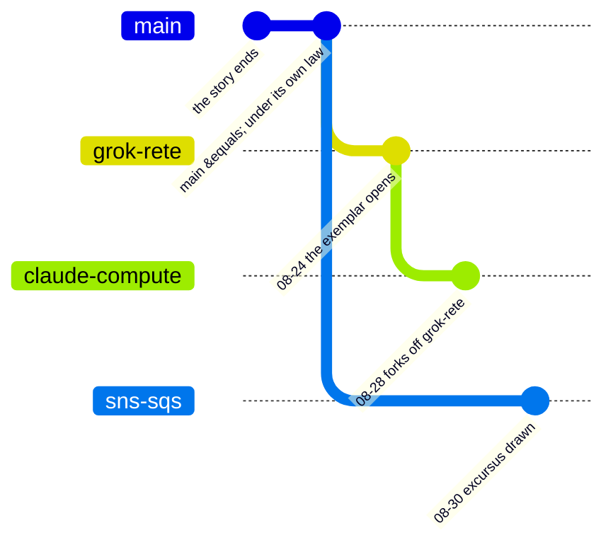

[The Story](/blog/story/prologue/) is the past. It runs from the first Python experiments to the moment the work stopped being one line — and there it rests.

This is what came after.

The work now runs on **four hosts**, as four concurrent and orthogonal fronts. A front is a **purpose**, not a branch and not a machine: one of them carries two branches, and one of them exists to arm the other three. Each runs as long as it must. Each keeps its own journal.

## The four

| front | what it is | where |
|---|---|---|
| [wat Under Its Own Law](/blog/fronts/under-its-own-law/) | the language made subject to the discipline it imposes on its users — every law `wat` enforces outward, turned on `wat`'s own body | `main` · johndesktop |
| [The Exemplar](/blog/fronts/exemplar/) | one reference implementation the rest of `wat` measures itself against | `grok-rete` · reason |
| [Services in Anger](/blog/fronts/services/) | where services are flawed and deficient, and the repeatable patterns for using `wat` in real use | `claude-compute` + `sns-sqs` · compute |
| [Ars Culta](/blog/fronts/ars-culta/) | *the craft that is tended* — the grimoire, the tooling, the record | portal |

Two things in that graph are easy to get wrong, and both were got wrong here first.

**`main` is not a trunk.** It is a front — *wat Under Its Own Law* — with no more claim to being the spine than the others have. There is nothing for the branches to merge *back into*; when a front finishes, it arrives rather than returns.

**`claude-compute` branched off `grok-rete`, not off `main`.** One front's branch descends from another's, which is what *a front is a purpose, not a branch* looks like in the commit graph. It also makes the obvious measurement lie: asked for `claude-compute`'s work, a merge-base range answers **133 commits**, of which **109 belong to The Exemplar**. Its own work is **24**. Every count on this site that touches a front is taken with explicit exclusion for that reason.

**Ars Culta is not in the graph at all**, because it is not a branch of this repository. It runs across four repositories from a laptop, which is exactly why it is the console and not a fourth hard problem.

## Why these opened

`portal` — the laptop where all of this began — stopped being able to hold it. A Rust build is not an event here; it is the steady state, and constant builds made the machine unusable *while* the work was happening. That is a limit on how much parallel thought one person can hold, not a hardware complaint.

Four hosts fixed it, and the property that matters is not speed: **each host contends only with itself.** Isolation of resources turned out to be isolation of attention.

## These first posts are backfill, and say so

The chronicle stopped on 2026-06-23 and did not resume for 76 days. **The work never stopped; the telling did.**

So the opening posts on each front cover June through August 2026 and were written in September. Every one of them carries `covers`, `written`, and `backfill: true` in its frontmatter. They are not live journal entries and do not pretend to be.

That gives them something a live entry cannot have: both vantages at once — the week as it happened, and the view from the far side that already knows how it turned out. After this batch the `backfill` field disappears and the fronts run weekly.
