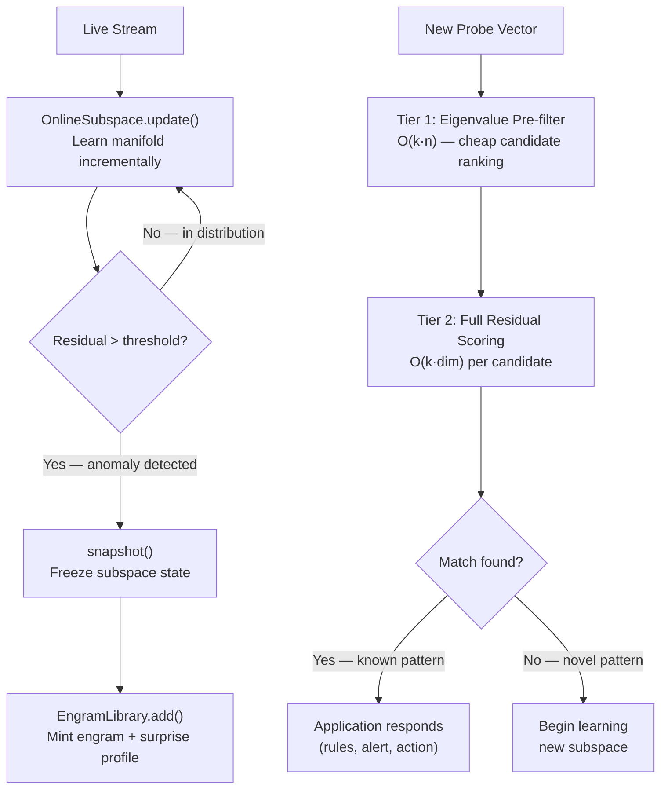

The algebra ops reference covered how to operate on vectors you already have. This page covers how Holon *learns* — how it builds a geometric model of what "normal" looks like from a stream of examples, detects when something falls outside that model, and then persists that knowledge as a named, portable memory artifact called an engram.

This is the memory layer. It sits on top of the encoding stack and algebra ops, and it's what turns a collection of vector operations into a system that improves with experience.

A note on how this came together. At some point during the challenge batches, we built a 3D visualization — a random orthogonal projection from 4096 dimensions down to 3, so we could actually look at where things landed in space. Synthetic attack traffic (SYN flood, UDP flood, ICMP flood patterns) and normal traffic showed up in dramatically different locations. Not close, not overlapping — separated. You could see it.

<video autoplay loop muted playsinline controls style="width: 100%; border-radius: 6px; margin: 1rem 0;">
  <source src="/vector-space-anomaly-detection.mp4" type="video/mp4" />
</video>

<p style="text-align: center;"><em>Left pane: the baseline accumulator drifting through 3D space as it learns normal traffic, then freezing once warmup completes. Right pane: each incoming packet decomposed into atoms → bindings → composite, colored green to red by cosine similarity to the frozen baseline. Attack traffic lands in a different region of the space entirely.</em></p>

<p style="text-align: center;"><em>This predates engrams. What you're seeing is the accumulator-and-cosine-threshold approach that made the spatial separation visible and sparked the idea. We haven't built an engram visualization yet.</em></p>

That's when it clicked. Those regions of space weren't arbitrary. They were measurable, describable, repeatable. If a cluster of vectors occupies a region, you can characterize that region geometrically. You can name it. You can ask whether a new vector falls inside or outside it. Engrams followed from that observation — they're the formalization of "this region of space is a thing we want to remember."

The theory came after the picture.

---

## The Core Concept: Manifold Learning

Any stream of encoded vectors — network packets, user events, document batches — occupies a region of the high-dimensional vector space. That region isn't random; it has structure. Normal HTTP traffic, for example, concentrates along certain directions: typical port distributions, common method/status combinations, characteristic byte-count ranges. The vectors don't fill all 16,384 dimensions equally — they cluster along a lower-dimensional manifold embedded in the full space.

`OnlineSubspace` learns that manifold from a stream of examples, one vector at a time, without storing any of the raw vectors. What it stores is a set of *principal components* — the directions of maximum variance in the observed data. These k directions (k ≪ dim — much less than — think 32 out of 16,384) define a subspace that captures the structure of normal.

Once learned, any new vector can be scored against the subspace. A vector that lies near the learned manifold has low reconstruction error (residual). A vector that falls far outside it — structurally unlike anything in the training stream — has high residual. That's the anomaly signal.

---

## `OnlineSubspace` — Incremental Manifold Learning

```
OnlineSubspace::new(dim=16384, k=32)
    dim: 16384  — vector dimensionality (must match encoder)
    k:   32     — number of principal components to track
```

Implemented using [CCIPCA (Candid Covariance-free Incremental PCA, Weng et al. 2003)](https://ieeexplore.ieee.org/document/1217609). CCIPCA updates the principal components one vector at a time with O(k·dim) cost per update — no matrix inversions, no batch requirements, no stored history. The subspace evolves continuously as new data arrives.

### Key parameters

| Parameter | Default | Effect |
|-----------|---------|--------|
| `k` | 32 | Number of principal components. More k = richer manifold model, higher compute cost. |
| `amnesia` | 2.0 | Forgetting exponent. Higher = forgets old data faster, adapts more quickly to drift. |
| `ema_alpha` | 0.01 | EMA decay for threshold tracking. Lower = smoother threshold, slower to adapt. |
| `sigma_mult` | 3.5 | How many standard deviations above the running average before something is flagged as anomalous. Higher = less sensitive, fewer false positives. |
| `reorth_interval` | 500 | Re-orthogonalize components every N updates to prevent numerical drift. |

### Core operations

**`update(vec)`** — Feed one vector into the subspace. Updates the mean, advances all k principal components via CCIPCA, updates the adaptive threshold EMA. Returns the residual of the new vector against the current subspace — useful for monitoring how anomalous the training stream is during warmup.

**`residual(vec)`** — Score a vector without updating. Returns reconstruction error: how far the vector falls from the learned manifold.

```python
def residual(x, mean, components):
    # Start with the centered vector
    remainder = x - mean
    # Remove the projection onto each principal component
    for component in components:
        projection = dot(remainder, component)  # how much of remainder lies along this component
        remainder = remainder - projection * component
    # What's left is the part the subspace can't explain
    return norm(remainder)
```

Low residual = the subspace explains most of the vector = in-distribution. High residual = the subspace can't account for it = anomalous.

**`project(vec)`** — Project a vector onto the subspace. Returns the component of the vector that lies within the learned manifold — what the subspace "recognizes" of the input.

**`reconstruct(vec)`** — Reconstruct the vector from the subspace. `mean + project(vec)`. The reconstructed vector is the subspace's best approximation of the input.

**`anomalous_component(vec)`** — The residual vector: `vec − reconstruct(vec)`. Not a scalar — the full-dimensional vector representing what the subspace *cannot* explain. This is the raw material for the surprise fingerprint.

**`threshold()`** — The current adaptive anomaly threshold. Updated every time `update()` is called:

```python
threshold = running_average_residual + sigma_mult * running_stddev_residual
```

"Is this vector anomalous?" is just `residual(vec) > threshold`. The threshold tracks the stream — if the stream gets noisier overall, the threshold rises to match. `sigma_mult` (default 3.5) controls how far above average something has to be before it trips the alarm.

**`explained_ratio()`** — Fraction of variance in the training stream captured by the k components. Useful for deciding whether k is large enough for the data.

**`snapshot()`** — Serialize the current subspace state into a `SubspaceSnapshot` — the mean vector, all k component vectors, and threshold state. Snapshots are what get stored in engrams.

---

## The Capacity Ceiling — Why One Subspace Isn't Enough

`OnlineSubspace` works well when the encoded vector has a moderate number of leaf bindings — the individual `bind(role, filler)` pairs that get bundled into the final vector. A network packet with `src_ip`, `dst_port`, `proto`, `ttl`, `bytes` produces ~7 bindings. The subspace learns these directions comfortably with k=32 components.

HTTP requests are different. A full request with TLS fingerprint fields, path segments, query parameters, headers (name + value each), cookies, and shape features can produce 80–100+ leaf bindings. That's 80–100 near-orthogonal directions superimposed in one vector. CCIPCA with k=32 components can't separate them — there are more structural directions in the data than the subspace has capacity to learn. The residual becomes noisy because the subspace can't explain the variance, and drilldown attribution becomes meaningless because every field interferes with every other field in the projection.

This is Kanerva's capacity ceiling applied to structured encoding. The theoretical limit for reliable recovery from a bundled superposition is roughly `O(dim / log(dim))` components. At dim=4096, that's ~330 components in theory — but CCIPCA's incremental approximation hits practical limits much sooner, especially with rank-1 data (each leaf binding is a single outer product, rank 1).

The fix isn't more dimensions or more components. It's fewer bindings per vector.

---

## `StripedSubspace` — Crosstalk-Free Attribution

`StripedSubspace` distributes leaf bindings across N independent subspaces. Instead of one vector with 100 bindings, you get N vectors with ~100/N bindings each. Each stripe learns its own portion of the data independently.

```
StripedSubspace::new(dim=1024, k=20, n_stripes=32)
    dim:       1024  — vector dimensionality per stripe
    k:         20    — principal components per stripe
    n_stripes: 32    — number of independent subspaces
```

### Stripe assignment

Each leaf binding is assigned to a stripe by hashing its fully-qualified domain name (the dotted path through the data structure) via FNV-1a:

```python
@staticmethod
def field_stripe(path: str, n_stripes: int) -> int:
    h = 0xCBF29CE484222325
    for b in path.encode("utf-8"):
        h ^= b
        h = (h * 0x100000001B3) & 0xFFFFFFFFFFFFFFFF
    return h % n_stripes
```

`"tls.cipher_suites"` always maps to the same stripe. `"headers.user-agent"` always maps to the same stripe. The assignment is deterministic — the same field always appears in the same stripe on every node, every restart, every cold boot. This is the same [hash-function-as-infrastructure](/blog/primers/series-001-001-atoms-and-vectors/#a-likely-contribution-the-hash-function-codebook) principle as the atom codebook: there's nothing to distribute or synchronize.

With 100 leaf bindings across 32 stripes, each stripe averages ~3 bindings. CCIPCA with k=20 components can learn 3 directions comfortably. The attribution problem disappears: if stripe 7 has a high residual, the anomaly is in the fields assigned to stripe 7, with no interference from the fields in stripes 0–6 or 8–31.

### Core operations

**`update(stripe_vecs)`** — Feed one observation (a list of N stripe vectors) into all stripes simultaneously. Returns the RSS aggregate residual — the root-sum-of-squares of all per-stripe residuals:

```python
residual = sqrt(r₀² + r₁² + ... + r₃₁²)
```

This is the scalar magnitude: how anomalous overall.

**`residual_profile(stripe_vecs)`** — Returns the N-dimensional vector of individual per-stripe residuals:

```python
profile = [r₀, r₁, r₂, ..., r₃₁]
```

This is the directional signal — the *pattern* of which stripes are anomalous. Two requests can have the same aggregate residual (same magnitude) but completely different profiles (different direction). A Firefox browser deviating from a Chrome-biased baseline lights up the TLS and header-ordering stripes. A Nikto scanner lights up the path-structure and missing-header stripes. Same distance from normal, different direction of deviation.

The aggregate `residual()` is just `norm(residual_profile())` — it collapses the N-dimensional profile into a single scalar. The profile preserves what the scalar discards.

**`anomalous_component(stripe_vecs, stripe_idx)`** — Returns the full-dimensional anomalous component for a specific stripe. This is the material for per-stripe surprise fingerprinting — the same unbinding-based attribution described below, but scoped to a single stripe's fields with no cross-stripe crosstalk.

**`snapshot()` / `from_snapshot()`** — Serialize and restore all N stripe subspaces. A striped engram carries N independent snapshots, each with its own mean, components, and threshold state.

### Why striping is a core primitive

`StripedSubspace` lives in the Holon library, not in any application. The capacity ceiling isn't specific to HTTP requests — any `Walkable` structure with enough fields will hit it. The striped encoder, the FQDN hashing, the per-stripe CCIPCA state — all of it is a generic primitive. An application calls `StripedSubspace(dim, k, n_stripes)` the same way it calls `OnlineSubspace(dim, k)`. The application decides what to encode; the library handles the crosstalk problem.

### The dual-signal principle

Every successful discrimination in the holon project has required both magnitude and direction. Cosine-to-centroid alone misses non-radial anomalies (batch 017). Eigenvalue spectrum alone produces negative gaps (batch 018). Aggregate residual alone can't separate a minority browser from a scanner at the same distance (the [spectral firewall](/blog/story/series-005-003-the-residual-profile/)). The residual profile is the directional signal that makes `StripedSubspace` more than a performance optimization — it's a detection primitive.

A tiny `OnlineSubspace(dim=32, k=1)` can learn the normal residual profile pattern during warmup. At decision time, both signals must agree: magnitude (is the aggregate residual above threshold?) and direction (does the profile pattern match known normal deviations?). Neither alone is sufficient. Combined, they haven't failed.

---

## `Engram` — A Named Memory

An engram is a named, serializable snapshot of a trained `OnlineSubspace`, plus metadata.

An engram can be serialized to disk, sent over the wire, and loaded on a different machine — and it will score incoming vectors exactly the same way it did on the node that minted it. This works because every node independently derives the same atom vectors from the same hash function. The vectors stored inside the engram were computed in a space that every other node already lives in. Load the engram, start scoring — no setup, no sync, no negotiation. The [coordination-free post](/blog/primers/series-001-004-coordination-free/) covers why this works at the encoding level.

```python
@dataclass
class Engram:
    name:                 str               # human-readable label
    snapshot:             SubspaceSnapshot  # mean, 32 components, threshold state
    eigenvalue_signature: list[float]       # normalized, used for fast pre-filtering
    surprise_profile:     dict[str, float]  # field → surprise magnitude at mint time
    metadata:             dict[str, Any]    # application-defined
```

### What each field is

**`snapshot`** — The full learned subspace at the moment of minting. Sufficient to reconstruct the `OnlineSubspace` and score any new vector against it.

**`eigenvalue_signature`** — A compact fingerprint of the pattern's "shape" in vector space. Each principal component captures some amount of variance in the training data; the eigenvalue for that component says how much. Scaled so the whole list has length 1 (so two signatures are comparable regardless of how much data each subspace saw — you're comparing proportions, not raw magnitudes). Used as a fast pre-filter: before running full residual scoring against every engram, the library ranks candidates by eigenvalue similarity to narrow the field cheaply.

**`surprise_profile`** — A per-field breakdown of what drove the anomaly at mint time. Computed by unbinding the anomalous component with each field's role vector and measuring the result's magnitude. Higher magnitude = that field contributed more to the anomaly. Application-specific: in the DDoS lab, this maps to concrete field names (`src_ip`, `dst_port`, `ttl`). In other applications, whatever fields were encoded.

**`metadata`** — Arbitrary application-defined key-value pairs. The DDoS lab stores EDN rule strings here — the filtering rules that were active when the engram was minted. A fraud detection system might store transaction category labels. A user-behavior model might store session context. The engram doesn't interpret the metadata; it carries it.

### Minting

Engrams are minted through `EngramLibrary::add()` rather than constructed directly. The library computes the eigenvalue signature, validates the snapshot, and stores the engram under its name.

### Matching

`engram.residual(vec)` scores a probe vector against the engram's stored subspace. The result is the same reconstruction error as `OnlineSubspace::residual` — how far the probe falls from the pattern this engram learned. Low residual = the probe looks like the pattern this engram represents.

---

## `EngramLibrary` — Pattern Memory Bank

The library holds many engrams and provides efficient matching across all of them.

```python
library = EngramLibrary(dim=16384)
library.add("pattern_name", trained_subspace, surprise_profile, metadata)
matches = library.match_vec(probe_vec, top_k=3, prefilter_k=10)
# → [("pattern_name", residual), ...] sorted ascending (lower = better fit)
```

### Two-tier matching

Scoring every engram with full residual computation for every probe is O(n·k·dim) — expensive at scale. The library uses a two-tier strategy:

**Tier 1 — Eigenvalue pre-filter** (O(k·n)): Rank engrams by eigenvalue energy. Higher energy = the subspace captured more variance = a "broader" pattern. This is a cheap proxy for which engrams are plausible candidates. The top `prefilter_k` engrams proceed to tier 2.

**Tier 2 — Full residual scoring** (O(k·dim) per candidate): Compute actual reconstruction error for each candidate. Return top-k sorted ascending by residual.

For small libraries (≤ `prefilter_k` engrams), tier 1 is skipped and all engrams are scored directly.

### `match_spectrum` — Eigenvalue-only matching

```python
matches = library.match_spectrum(probe_eigenvalues, top_k=5)
# → [(name, cosine_similarity), ...] sorted descending
```

Even faster than `match_vec` — skips full residual computation entirely and just compares eigenvalue shapes using cosine similarity.

The interesting use case: instead of probing with a single packet vector, you train a short-window subspace over the last 30 seconds of traffic, then ask "does the *shape* of this window match any known pattern?" You're comparing learned geometry to learned geometry — the variance fingerprint of a live traffic window against the variance fingerprints of known attack patterns. If a SYN flood is building, the eigenvalue shape of the current window starts resembling the eigenvalue shape of previously seen SYN floods before any individual packet would trigger a residual hit. Early warning, cheap to compute, no per-packet scoring required.

### Persistence

```python
library.save("engrams.json")
library = EngramLibrary.load("engrams.json")
```

The full library serializes to JSON — mean vectors, component matrices, threshold state, eigenvalue signatures, surprise profiles, metadata. On load, subspaces are reconstructed lazily (on first `residual()` call) to avoid paying the full reconstruction cost upfront. On restart, previously learned patterns are immediately available for matching.

---

## The Full Lifecycle



The engram isn't the action — it's the memory. What happens on a hit is entirely up to the application. The DDoS lab deploys firewall rules. A fraud system might flag a transaction. A recommendation engine might serve a cached result. The pattern recognition is the library's job; the response is yours.

---

## Surprise Fingerprint: Unbinding the Anomaly

The `surprise_profile` deserves a closer look because it demonstrates something specific about why Holon's algebraic transparency matters.

When a pattern is detected, the anomalous component is:

```
anomalous = vec - reconstruct(vec)   # what the subspace can't explain
```

This is a full-dimensional vector in the same space as everything else. Because of VSA's binding algebra, you can unbind it with any field's role vector to isolate that field's contribution:

```python
for field_name in ["src_ip", "dst_port", "ttl", ...]:
    role_vec = encoder.get_vector(field_name)
    unbound  = bind(anomalous_component, role_vec)
    surprise  = norm(unbound)   # higher = more anomalous in this field
```

The result is a ranked list of which fields drove the anomaly — not a black-box score, but a decomposed, interpretable attribution. This is only possible because the encoding is algebraically transparent: the field relationships are recoverable from the vector because they were built from reversible operations.

Concretely — given a packet that triggered the detector:

```python
packet = {
    "src_ip":   "203.0.113.42",
    "dst_ip":   "10.0.0.1",
    "dst_port": 53,
    "proto":    "UDP",
    "ttl":      245,
    "bytes":    1420,
    "tcp_flags": 0,
}

surprise_profile = {
    "dst_port":  0.91,   # strongly anomalous — port 53 unexpected
    "ttl":       0.87,   # strongly anomalous — TTL 245 unusual
    "bytes":     0.79,   # anomalous — 1420 bytes atypical for this traffic (near MTU)
    "proto":     0.41,   # mildly anomalous — UDP less common than TCP in baseline
    "src_ip":    0.12,   # unremarkable — IPs vary normally
    "dst_ip":    0.09,   # unremarkable
    "tcp_flags": 0.06,   # unremarkable — zero flags expected for UDP
}
```

`dst_port`, `ttl`, and `bytes` stood out. `src_ip`, `dst_ip`, and `tcp_flags` look normal — the subspace has seen plenty of that variation. A rule generator reading this can write `(and (= dst_port 53) (= ttl 245))` and ignore the rest.

The surprise profile is computed at mint time and stored in the engram. On a hit, it's immediately available — no recomputation needed.

---

## `Journal` — N-ary Discriminant Learner

Where `OnlineSubspace` learns what *normal* looks like (anomaly detection), `Journal` learns what *separates classes* (classification). Both are memory-layer primitives. Both learn from a stream without storing raw vectors.

```
Journal::new("market", dims, recalib_interval)
    dims:              10000  — vector dimensionality (must match encoder)
    recalib_interval:  500    — updates between discriminant recomputations
```

A Journal maintains one `Accumulator` per registered label. Labels are symbols — `Label(u32)` handles created by `journal.register("Buy")`. Binary, ternary, N-ary — the Journal doesn't know or care how many classes exist.

### Core operations

**`register(name) → Label`** — create a label symbol. Idempotent: registering the same name twice returns the same handle.

**`observe(&vec, label, weight)`** — accumulate a labeled observation. The vector is added to the accumulator for the given label, scaled by weight. Periodically (every `recalib_interval` calls), the Journal recomputes the discriminants.

**`predict(&vec) → Prediction`** — score the input against all discriminants. Returns scores ranked by absolute cosine, plus the winning label (`direction`) and its magnitude (`conviction`). At prediction time, the mean prototype — the average of all label prototypes — is subtracted from the input to strip shared structure before the cosine. This removes the ~90% of the encoding that is common across all classes, leaving only the deviation that separates them.

**`decay(factor)`** — fade all accumulators. Older observations contribute less. Call once per time step regardless of whether a label was observed.

**`resolve(conviction, correct)`** — record a prediction outcome for curve self-evaluation.

**`curve() → Option<(a, b)>`** — fit the conviction-accuracy curve: `accuracy = base + a × exp(b × conviction)` where `base = 1/N` (random chance for N labels). Returns the fitted parameters, or `None` if insufficient resolved predictions have accumulated.

### Discriminant computation

Each label's discriminant is `normalize(proto_i − mean(proto_j for j ≠ i))` — the direction that separates label i from the centroid of everything else. For two labels this is `normalize(buy_proto − sell_proto)`. For three labels, each label gets its own direction. Prediction is one cosine per discriminant; the label with the highest absolute cosine wins.

The conviction-accuracy curve — the exponential relationship between projection magnitude and prediction correctness — is a method on the primitive, not external infrastructure. The Journal evaluates its own performance. Applications query it to make sizing and gating decisions.

### Applications

The [trading lab](/blog/story/series-006-001-the-thought-machine/) uses Journal for direction prediction (Buy/Sell labels) across six specialized observer vocabularies. The manager uses a second Journal to learn which observer panel shapes predict profitable trades (Win/Lose labels). The same 238-line struct handles both levels without modification.

The Journal is domain-agnostic. Any stream of labeled vectors — network traffic classes, document categories, sentiment labels — can be classified by registering the appropriate labels and feeding observations. The conviction-accuracy curve evaluates whether the vocabulary carries signal for the task.

---

## Likely Contributions to the Field

The same caveat as the algebra ops page: honest assessment, not a priority claim.

**The engram architecture as a whole.** HDC memory systems in the literature store class prototypes or cluster centroids — fixed vectors representing known categories. [LifeHD (2024)](https://arxiv.org/abs/2403.04759) uses a two-tier associative memory with cluster centroids. [GrapHD](https://www.frontiersin.org/articles/10.3389/fnins.2022.757125/full) stores graph-structured memories. None of these match Holon's approach: storing a full learned *subspace* (not a centroid) as the memory artifact, with eigenvalue pre-filtering for efficient retrieval, application-defined metadata attached to each engram, and a lifecycle that covers minting, matching, persistence, and cold-start recovery. The engram is not a prototype vector — it's a named, serializable learned manifold with an associated metadata payload.

**CCIPCA subspace learning as the detection primitive.** The HDC anomaly detection literature ([HyperDetect](https://discovery.researcher.life/article/hyperdetect-a-real-time-hyperdimensional-solution-for-intrusion-detection-in-iot-networks/de033f6a64413122a5ec093d5b136eed), and others) uses prototype vectors and cosine similarity thresholds. Holon provides `OnlineSubspace` — an online incremental PCA (CCIPCA) primitive that learns the manifold of observed data and scores new vectors as reconstruction error against it. The DDoS lab uses this for anomaly detection against normal traffic baselines; other applications can use it however they choose. The detection mechanism itself — manifold-aware rather than prototype-based — does not appear in the HDC literature we reviewed.

**Two-tier eigenvalue pre-filter for engram matching.** Using the normalized eigenvalue signature of a stored subspace as a fast pre-filter before full residual scoring — O(k·n) before O(k·dim) — is a specific engineering contribution. The eigenvalue signature encodes the "shape" of a learned pattern compactly enough to cheaply rank candidates before paying the full scoring cost.

**Field attribution via VSA unbinding of the anomalous component.** The surprise fingerprint — unbinding the reconstruction residual with field role vectors to isolate per-field anomaly contributions — exploits VSA's algebraic transparency in a way that doesn't appear in HDC anomaly detection literature. Neural anomaly detection systems can't do this at all; their representations aren't decomposable. Holon's can because the encoding is built from reversible operations.

**Passive upgrade via engram distribution.** A learned pattern can be serialized, transmitted, and matched against in the same vector space on any node — no code deployment, no vocabulary sync. The engram is a self-contained unit of geometric knowledge: load it, score against it, done. How consumers handle hot-loading is application-defined, but the format makes it viable in a way that prototype-vector or rule-based systems don't. This distribution model doesn't appear in the HDC deployment literature.

**Striped FQDN leaf hashing for crosstalk-free VSA attribution.** Distributing leaf bindings across independent subspaces by fully-qualified domain name hash, reducing per-stripe binding count from ~100 to ~3 and eliminating the attribution crosstalk that makes monolithic high-dimensional encoding unusable for field-level anomaly explanation in high-cardinality structured data.

**Residual profile as dual-signal detection primitive.** Using the per-stripe residual vector — already computed as an intermediate value in RSS aggregation — as an N-dimensional directional signal alongside the scalar magnitude. This enables detection decisions that distinguish iso-magnitude anomalies by their stripe activation pattern, at negligible additional cost (~3000x cheaper than one stripe operation).

**N-ary discriminant learner with self-evaluating conviction-accuracy curve.** The Journal primitive combines discriminant-based classification with an integrated exponential curve fit that maps conviction magnitude to prediction accuracy — `accuracy = 1/N + a × exp(b × conviction)`. The primitive evaluates its own performance without external infrastructure. HDC classification literature uses prototype vectors and nearest-centroid matching; the discriminant approach (normalized difference between class prototypes, with mean-stripping to remove shared structure) and the self-evaluating curve appear to be novel in the HDC context.

If any of this maps to existing published work, we'd genuinely want to know.
