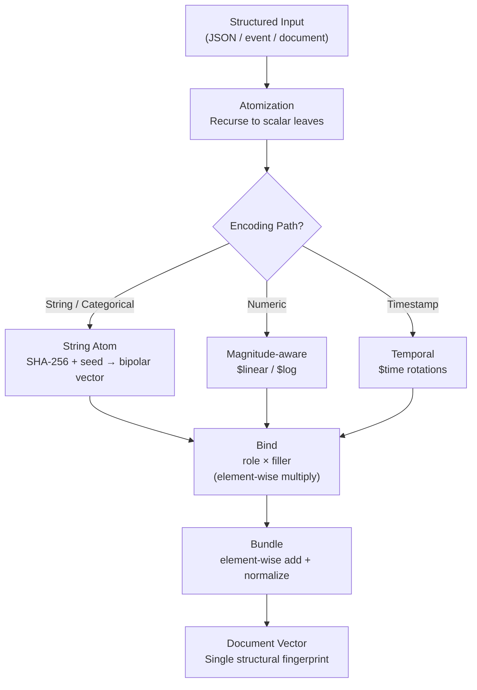

Before the challenge batches, before the anomaly detection results, before the XDP scrubber — there's a question that has to be answered: how does a JSON document become a point in a 4096-dimensional vector space? And why does that transformation preserve anything useful?

This is the foundational concept. Everything else in Holon sits on top of it.

---

## Scalar Encoding: Three Paths

Holon has multiple scalar encoding paths, chosen based on the semantic nature of the value. The current set:

**String atomization** — the default for categorical values. The value is treated as an opaque identifier and mapped to a unique high-dimensional vector called an *atom*. `"priority"`, `"high"`, `"GET"`, `"dst_port"`, `"10.0.0.1"` — all atoms. Crucially, `"80"` and `"81"` as atoms are as different as `"80"` and `"banana"`: no proximity is implied. This is correct for protocol names, IP addresses as identifiers, status code categories, and any field where similarity-in-value-space has no semantic meaning.

**Magnitude-aware encoding** (`$linear`, `$log`) — for numeric values where proximity should be geometrically reflected. A packet with 50 bytes should be similar to a packet with 55 bytes; not to a packet with 1400 bytes near the MTU ceiling. The `$linear` marker encodes value on a linear scale; `$log` on a logarithmic scale, suited for quantities spanning orders of magnitude. The mechanism: interpolate between two deterministic orthogonal basis vectors weighted by the value's normalized position on the scale. Nearby values produce similar interpolations; distant values produce near-orthogonal results.

**Temporal encoding** (`$time`) — for timestamps where the relevant similarity is cyclical. Monday 9am should be similar to Tuesday 9am, and to Monday 9am next week — same hour-of-day, same day-of-week position in the cycle. Encoding a Unix timestamp as a string or linear magnitude loses all of this. The temporal encoder decomposes the timestamp into circular components (hour-of-day, day-of-week, month) and encodes each as a rotation between two orthogonal basis vectors, so the geometry reflects the cyclic structure of time.

Choosing the wrong path corrupts the geometry. Encode a byte count as a string atom and you've thrown away the ordering that makes "3x normal rate" detectable. Encode a protocol name linearly and you've implied `TCP` and `UDP` are numerically adjacent in some meaningful sense. The choice is explicit, marked in the data at encode time.

**Atoms** are what string-encoded scalars produce. Each atom maps to a deterministic vector:

```python
import hashlib
import numpy as np

def get_vector(atom: str, global_seed: int = 42, dimensions: int = 4096) -> np.ndarray:
    # SHA-256 of atom string, XOR'd with global seed
    atom_hash = hashlib.sha256(atom.encode("utf-8")).digest()
    atom_int = int.from_bytes(atom_hash[:8], "big")
    seed = atom_int ^ global_seed

    # Seed a NumPy RNG and generate bipolar values in {-1, 0, 1}
    rng = np.random.RandomState(seed & 0xFFFFFFFF)
    return rng.choice([-1, 0, 1], size=dimensions).astype(np.int8)
```

`SHA-256(atom_string) XOR global_seed` → deterministic 4096-dimensional vector. Same atom, same language implementation, any machine, any process: identical vector. The XDP sidecar creates a fresh encoder on boot — no codebook to load — and re-derives identical atom vectors from the hash function every time.

Why bipolar values in `{-1, 0, 1}`? Two random bipolar vectors in 4096 dimensions are approximately orthogonal: expected cosine similarity 0, standard deviation ~1/√4096 ≈ 0.016. A very large budget of nearly-orthogonal basis atoms before the space gets crowded.

Since the mapping is fully deterministic, any caching strategy is valid. Holon's implementations cache computed vectors in a dict keyed by atom string — hit the cache if the atom was seen before, recompute if not, same result either way. In high-throughput deployments with a bounded vocabulary (a fixed set of field names and categorical values), a simple dict fills quickly and stays warm. For more open-ended vocabularies you might cap capacity with an LRU or bounded cache, accepting occasional recomputation for infrequently-seen atoms. You could also pre-compute a codebook for a known atom set and serialize it — useful when startup latency matters or when you want to share a fixed vocabulary across processes. None of this affects correctness; it's purely a throughput tradeoff.

---

## Atomization: Breaking Structure Down

"Atomization" is the process of reducing a structured input to its scalar leaves and applying the appropriate encoding path to each. A JSON document:

```json
{
    "dst_port": 80,
    "src_ip":   "10.0.0.1",
    "method":   "GET",
    "status":   200,
    "bytes":    52,
    "timestamp": 1738000000
}
```

...resolves to scalar encodings with explicit path choices:

```
field "dst_port"  → atom("dst_port")  ×  atom("80")           # categorical: exact port match
field "src_ip"    → atom("src_ip")    ×  atom("10.0.0.1")     # categorical: IP as identifier
field "method"    → atom("method")    ×  atom("GET")           # categorical
field "status"    → atom("status")    ×  atom("200")           # categorical
field "bytes"     → atom("bytes")     ×  log_encode(52)        # magnitude: nearby sizes similar
field "timestamp" → atom("timestamp") ×  time_encode(...)      # cyclical: same time-of-day similar
```

Field names are always atoms — they're role identifiers, and role identity should be discrete. Values get whichever path reflects their semantic nature. The same numeric value `80` can be a categorical atom (`dst_port: 80` as exact port) or magnitude-encoded (`ttl: 80` where nearby TTLs should be similar) depending on what similarity you want the geometry to express.

Lists and nested structures recurse. The choice of how to encode a list depends on what its ordering semantics mean — and Holon makes that choice explicit rather than assuming. The current modes:

- **`positional`** (default) — each item is bound to a position atom before bundling. Order matters: `["a", "b", "c"]` and `["c", "b", "a"]` produce different vectors.
- **`bundle`** — items are bundled with no positional encoding. Order is ignored; `["a", "b"]` and `["b", "a"]` produce the same vector. Right for tags, categories, any list where position is meaningless.
- **`chained`** — each item is bound to the previous item rather than an absolute position. Encodes relative adjacency; what matters is what comes next, not where in the sequence something sits.
- **`ngram`** — overlapping pairs and triples of adjacent items are bound together and bundled. Encodes local context windows, useful for text-like sequences where nearby elements are semantically related.

Python `set` types look similar to `bundle` at first — both ignore order — but they take a separate path: items are bundled and the result is then bound to a `set_indicator` atom. That extra binding shifts the final vector into a distinct region of the space. A set encoding and a bundle-mode list encoding of the same elements are *not* similar to each other. It's a type tag baked into the geometry: probing a document vector with a set-encoded query matches against sets specifically, not ordered lists that happen to share elements.

This list isn't closed. The encoding mode is a parameter, and new modes are straightforward to add — any function that maps a sequence of item vectors to a single vector is a valid list encoder. The current set covers the cases that came up in the experiments; what's right for a given domain is a design choice, not a constraint.

---

## Binding: Encoding Relationships

A scalar vector by itself encodes nothing useful. Whether it's an atom for `"GET"` or a magnitude-interpolated vector for `1500` bytes, the vector sits alone in 4096-dimensional space with no context — it means "this value exists somewhere," but not where or why. The question is which field it belongs to. `{"dst_port": 80}` and `{"src_port": 80}` both involve the value 80, but they are structurally completely different.

This is what *binding* does. Element-wise multiplication of two vectors:

```python
bound = bind(role_vector, filler_vector)
# = element-wise multiply: bound[i] = role[i] * filler[i]
```

The result is a new vector that encodes the *relationship* between the role and filler, not either one individually. `bind("dst_port", "80")` is approximately orthogonal to both `get_vector("dst_port")` and `get_vector("80")` — and it's also approximately orthogonal to `bind("src_port", "80")`, because the different role vectors produce different products.

This is the property that makes structural encoding work. Without role-filler binding, a document containing `{"dst_port": 80}` and a document containing `{"src_port": 80}` look similar — both contain the atom "80". With binding, they look different, because the bound pair encodes the structural position of the value, not just its existence.

The benchmark from challenge 011 puts a number on this: naive atom bundling (no role-filler binding) achieves F1=0.368 on attack detection. With binding: F1=1.000. The structural distinction that binding encodes is the difference between a detector that works and one that doesn't.

---

## Bundling: Superposing Components

A single bound pair represents one field. A document has many fields. The operation that combines them is *bundling* — element-wise addition of all the bound pairs, followed by normalization:

```python
doc_vector = bundle([
    bind(role("dst_port"), atom("80")),
    bind(role("src_ip"),   atom("10.0.0.1")),
    bind(role("method"),   atom("GET")),
    bind(role("status"),   atom("200")),
])
```

The result is a single 4096-dimensional vector that simultaneously encodes all four field relationships. This is superposition in the VSA sense: multiple components coexist in the same vector, not by storing them separately, but by adding them together in a high-dimensional space where they don't interfere much (because the bound pairs are nearly orthogonal).

The superposition is lossy — you can't perfectly recover the individual components from the bundle. But you can *probe* it: compute the cosine similarity between the bundle and any individual component, and get a meaningful score. A document bundle probed with `bind("dst_port", "80")` will return a high similarity if and only if the document contains `dst_port: 80` as a field. The structural query is a geometric query.

---

## Vectorization: The Full Stack

Atomization → binding → bundling is the complete encoding stack. The full traversal:



The recursion handles arbitrary nesting naturally. A deeply nested document like:

```json
{
    "request": {
        "method": "GET",
        "headers": {
            "content-type": "application/json",
            "x-forwarded-for": "10.0.0.1"
        }
    },
    "response": {
        "status": 200,
        "bytes": 52
    }
}
```

...bottoms out at the same scalar leaves. `"request.headers.content-type"` becomes a role atom; `"application/json"` becomes a filler atom. The path to the value becomes the role. The nesting depth doesn't change the algebra — every leaf still produces a bound pair, all bound pairs still bundle into one vector. A three-level-deep field and a top-level field are structurally equivalent from the encoder's perspective.

What goes in is a structured document with nested keys, typed values, and relational structure. What comes out is a single vector — one number per dimension. The encoding preserved the structure geometrically: structural similarity between documents maps to cosine similarity between their vectors.

---

## The Document Vector as Structural Fingerprint

There's a property of this encoding that doesn't appear in most discussions of VSA but matters significantly for what Holon does with it: the document vector is simultaneously a *hash function* and a *queryable fingerprint*.

As a hash function: same document, same implementation, same seed → identical vector. Always. Like MD5 or SHA-256, you can use document vectors as deterministic keys. Two processes encoding the same JSON payload independently arrive at the same vector without coordination.

Unlike MD5 or SHA-256: the output has geometry. You can measure distance between two document vectors and get a meaningful similarity score. Two documents that differ only in `bytes: 52` vs `bytes: 55` — identical structure, slightly different magnitude value — will produce vectors with cosine similarity close to 1.0. Two documents with completely different field structures will be near-orthogonal. The fingerprint reflects structural proximity, not just identity.

This is what makes the original database idea — "find documents structurally similar to this query" — viable as a geometric operation. And it's what makes the DDoS detector work: not "have I seen this exact packet before?" but "is this packet geometrically similar to the attack distribution I've accumulated?" Exact identity is the degenerate case of cosine=1.0. Partial structural match is cosine≈0.7. Near-orthogonal is "unrelated." One operation, three interpretations, all falling out of the same encoding.

---

## Why Determinism Matters — And What It Actually Guarantees

The deterministic encoding property — `atom("X")` always produces the same vector — has implications beyond reproducibility. But the guarantee has a precise scope that's worth being explicit about.

**Within a single language implementation**, determinism is total. Any two processes using the same seed and dimensionality will produce bitwise identical vectors for the same atom. Startup looks like:

```python
from holon.kernel.vector_manager import VectorManager
from holon.kernel.encoder import Encoder

vm = VectorManager(global_seed=42, dimensions=16384)
encoder = Encoder(vm)
```

No codebook file. No model download. No state to persist or recover. The encoder is fully reconstructed from the hash function on every start. If a process crashes and restarts, it re-derives identical vectors for every atom it sees. Any two processes using the same seed can independently produce, verify, and extend each other's encodings without coordination. (The XDP packet filter in the DDoS lab does exactly this — boots cold, derives every atom vector on demand from the hash function, no codebook loaded from disk, no shared state with the process that designed the encoding strategy.)

This is what the prologue calls "a hash function with geometric properties." Regular hash functions map inputs to fixed-size integers where the output is opaque. Holon's atom vectors map inputs to high-dimensional vectors where the output has exploitable geometry: you can probe, bind, bundle, and compare. The hash metaphor is apt. The geometry is what's new.

One hard constraint: every node in a deployment must use the same language implementation. Different languages use different RNGs downstream of SHA-256, producing incompatible vectors. Stay consistent and the problem doesn't exist.

---

## A Note on the Codebook

In most VSA systems, a codebook is load-bearing. Atom vectors are *assigned* — generated once, stored, and distributed to every node that needs them. Without the codebook, the system can't function; there's no way to recover a vector for an atom you haven't seen before. The codebook is infrastructure.

Holon doesn't have this problem. Every atom vector is *computed* on demand from the hash function. There's no vocabulary to distribute, version, or keep in sync — the function is the vocabulary. A new process, a new node, a cold-booted sidecar: all of them derive identical vectors for any atom they encounter, independently, without coordination.

"Codebook" appears in Holon's source and docs to mean something much narrower: the runtime cache of already-computed atom vectors. Pure performance optimization. Hit the cache if the atom was seen before, recompute from the hash function if not. Evict the entire cache and recompute everything — the results are identical. The cache is not the source of truth; the hash function is.

This has a distributed systems implication that's easy to miss. In a conventional VSA system you need to solve the codebook distribution problem before you can run anything at scale: every node needs the same atom vectors, which means either a shared store, a synchronization protocol, or a bootstrap sequence. That infrastructure becomes a coordination bottleneck.

Holon has none of that. Every node derives the same atom vectors independently from the same hash function. An HQ process can learn baselines, accumulate prototypes, and mint engrams against live traffic — then distribute that knowledge to edge nodes as vectors directly. The edge re-derives identical atom vectors on demand and operates in the same vector space. Coordination happens at the data layer, not the encoding layer. The encoding layer scales horizontally for free.

The fixed-width vector space makes the distribution cost model tractable. A learned engram — a named, serialized unit of geometric knowledge — arrives as a data structure of known, bounded size and gets loaded into the memory bank immediately. What the consumer does on a hit is application-defined; the engram is the memory, not the action. No code deployment. No config reload. No restart. The edge node doesn't need to understand what the engram encodes; it runs the matching operation against it and gets a score. The per-node cost to distribute a new pattern is constant in the complexity of the pattern. The per-packet scan cost grows linearly with the number of engrams in the library — but that scan is over fixed-width vectors using operations that SIMD parallelism is designed for, with a small constant per engram.

---

With this foundation in place, the challenge batches make more sense mechanically. Every experiment is a test of what can be expressed as atomization → binding → bundling, and what algebraic operations over the resulting vectors can do.

---

## A Likely Contribution: The Hash-Function Codebook

Standard VSA systems require a pre-shared codebook — a vocabulary of atom-to-vector mappings that every node in a system must agree on before any encoding can happen. This is load-bearing infrastructure: distribute it, version it, keep it in sync.

Holon eliminates this entirely by deriving atom vectors deterministically from a hash function. `SHA-256(atom_string) XOR seed` produces a deterministic RNG seed that generates the vector. Same atom, same seed, same implementation: identical vector, always, on any machine, without coordination. The hash function *is* the codebook. There's nothing to distribute.

We haven't found this approach documented in the VSA literature. The standard assumption is assigned vectors from a pre-shared vocabulary. Computed vectors from a deterministic hash function — with all the distributed systems implications that follow — appears to be a Holon contribution. The [algebra ops post](/blog/primers/series-1-002-holon-ops/) and [memory post](/blog/primers/series-1-003-memory/) cover the downstream implications; this is where it starts.
