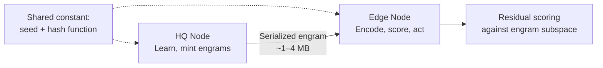

Every distributed system that does encoding eventually runs into the same problem: how do you make sure every node is using the same vocabulary?

In conventional VSA systems, atom vectors are assigned — generated once, stored in a codebook, and distributed to every node that needs to encode anything. The codebook is load-bearing infrastructure. Every encoder needs it before it can do anything. That means you need a distribution mechanism, a versioning strategy, a synchronization protocol, and a bootstrap sequence for new nodes. None of that is hard in isolation, but all of it is operational overhead that scales with the number of nodes and the rate of vocabulary change. It's also a coordination bottleneck: if the codebook service is down, encoding stops.

Holon doesn't have a codebook. It never did. That was a deliberate early design decision, and it turns out to have been the right one.

---

## The Design Decision

Categorical values — strings, identifiers, field names, enum-like values — are represented as string atoms. The vector for any string atom is computed on demand:

```python
import hashlib, numpy as np

def get_vector(atom_string: str, seed: bytes, dim: int) -> np.ndarray:
    digest = hashlib.sha256(seed + atom_string.encode()).digest()
    rng = np.random.default_rng(np.frombuffer(digest, dtype=np.uint8))
    return rng.integers(-1, 2, size=dim, dtype=np.int8)
```

`SHA-256(seed || atom_string)` seeds an RNG that generates the vector. Same atom, same seed, same implementation: identical vector, every time, on any machine, without coordination. The function is the codebook.

Numeric scalars take a different path. Magnitude-aware encodings (`$log`, `$linear`) and temporal encodings (`$time`) don't hash the value directly — they blend between anchor vectors based on where the value falls in a range. The anchor vectors *are* hash-derived string atoms (e.g., the low and high boundary labels for a field), so the same coordination-free property holds for them. The blend itself is deterministic given the value and the anchors. No coordination required there either.

There's nothing to distribute. There's nothing to version. There's nothing to keep in sync.

The seed is the only shared parameter. It's a constant — set once, baked into the deployment. New nodes don't need to fetch anything; they derive the same vectors the first time they see an atom. The codebook is a cache of work already done, not a source of truth.

---

## What This Actually Eliminates

In a conventional distributed VSA system you solve the codebook problem before you solve anything else. The operational checklist looks roughly like:

- Shared store for atom→vector mappings (Redis, S3, a database)
- Bootstrap sequence: new node fetches codebook before accepting work
- Version management: if the vocabulary grows, how do nodes stay consistent?
- Failure mode: encoding is unavailable when the shared store is unavailable

Holon's checklist:

- Same seed constant in every node's config

That's it. A new node boots, starts encoding, derives atom vectors on first encounter, caches them locally. It operates in exactly the same vector space as every other node in the deployment without ever talking to any of them. Coordination happens at the data layer — the structured documents that nodes exchange — not the encoding layer.

The encoding layer scales horizontally for free.

---

## The HQ/Edge Model

The distributed systems payoff is most visible in an HQ/edge architecture.



An HQ node runs continuously against live data: accumulating baselines, learning subspace models of normal behavior, minting engrams when patterns crystallize. This is computationally intensive work — CCIPCA updates on every sample, prototype extraction, subspace snapshots. It's exactly the kind of work you want to centralize.

An edge node operates against a stream in real time. It needs to encode incoming data, score it against known patterns, and act on anomalies — fast. It does not want to run online learning; that's HQ's job.

The handoff between HQ and edge is a serialized engram: a named subspace snapshot with a mean vector, principal components, an adaptive threshold, and whatever metadata the application attaches. The vector payload size is fixed at whatever dimensionality and k (number of principal components) the deployment chose. The subspace stores f64 vectors (8 bytes per element), so at 16,384 dimensions with k=32, that's 33 vectors × 128KB each ≈ 4MB for the vector payload; at 4,096 dimensions with k=32, ≈ 1MB. Not trivial, but small relative to a model weight file or a rule database, and constant regardless of how complex the learned pattern is.

Dimensionality is a deployment constant, like the seed. Every node that shares vector data must agree on the same value. Pick it once at deployment time; it doesn't change.

The edge node loads the engram, re-derives atom vectors on demand from the same hash function, and immediately operates in the same geometric space as HQ. It doesn't need to understand what the engram encodes. It runs the matching operation — residual scoring against the subspace — and gets a score. What it does with that score is application-defined.

This is where the hash-function codebook stops being a convenience and becomes a correctness requirement. An engram stores the mean vector and principal components of a learned subspace — vectors computed from data that was encoded on HQ. If the edge derived different atom vectors from the same inputs, those stored vectors would be geometrically incoherent in the edge's space. Residual scoring would produce meaningless numbers. The engram system doesn't work at all without stable, identical vector derivation across every node. Determinism isn't an optimization here; it's the foundation the entire memory layer stands on.

No code deployment. No config reload. No restart. New intelligence arrives as data.

---

## Passive Upgrade

The phrase "passive upgrade" is worth defining precisely.

In a rule-based system, adding a new detection capability is an operational event: write the rule, test it, deploy it, restart the service, verify. Every rule is a code change. The operational burden per rule is roughly constant, which means the system gets harder to maintain as it gets more capable.

In Holon, adding a new detection capability means distributing a new engram. The edge node picks it up, adds it to its library, and starts matching against it on the next packet — or the next document, or the next event, depending on the application. The engram *is* the capability; it carries the learned pattern, the threshold, and the metadata that describes what a hit means.

You still need to move engrams around safely — with versioning, rollback capability, and whatever delivery mechanism fits your infrastructure. But the operational category has shifted. An engram is configuration, not code. Config management, not a deploy pipeline. No build step, no test suite gate, no service restart. The difference matters: config can be swapped, rolled back, and audited as data. Code changes require a whole different process.

Engram matching cost grows linearly with library size — O(n) dot products over fixed-width vectors, SIMD-friendly. Whether that runs per-event or against sampled windows depends on timing budget: a WAF has milliseconds per request and can score inline; a kernel-speed packet processor can't, so the engram library informs pre-compiled rules instead (the DDoS lab architecture, covered later). Either way, adding a new engram is config management, not a software release.

Compare to Rete-based rule systems, where every new rule potentially invalidates the compiled network and requires a rebuild. Or threshold-based systems, where tuning a new threshold for a new attack class requires a human in the loop. Holon's memory layer is append-only by design. Engrams accumulate; they don't conflict.

---

## What This Requires

One constraint: **stay in one language per deployment.**

The hash function is deterministic. The RNG seeded by that hash is language-specific. Python's `numpy.random.default_rng` and Rust's `ChaCha8Rng` produce different sequences from the same seed. The atom vector for `"dst_port"` in Python is not the same as the atom vector for `"dst_port"` in Rust. Vectors computed in different languages are not compatible — cosine similarity between them is meaningless.

This is not a limitation worth engineering around. Pick a language for a deployment, use it everywhere. The coordination-free property holds completely within that constraint, which is the constraint any sane deployment already obeys.

---

## The Broader Implication

The hash-function codebook is a small idea with a large surface area.

It means Holon can operate usefully in environments where distributed coordination is expensive or impossible: air-gapped networks, edge deployments with unreliable connectivity, systems that need to start encoding before any bootstrap sequence completes. Any node with the seed constant and the implementation can encode anything, independently, from cold boot.

It also means every node occupies the same geometric space — not by connecting to anything, but by running the same function. The seed and dimensionality define a coordinate system that exists nowhere physically but is instantiated identically everywhere. You're a member of this space the moment you run the hash function. There's no network to join. The space *is* the network.

*(If that sounds like something from a physics lecture you skipped, you're not wrong. Two nodes, no messages, same space. We're not claiming quantum entanglement — but we're not not thinking about it either.)*

It also means the vector space is stable across time. Atom vectors don't drift as vocabulary grows. A vector computed against `"src_ip"` today is identical to a vector computed against `"src_ip"` a year from now on a different machine running the same implementation. Engrams minted today are valid indefinitely — the geometric relationships they encode don't expire. There's no model to retrain, no vocabulary to version, no stored representations that go stale.

Conventional VSA approaches treat the codebook as infrastructure. Holon treats the hash function as infrastructure. Hash functions don't go down. They don't need versioning. They don't have bootstrap sequences. They're just math — and math scales for free.

We didn't find this approach documented in the VSA literature. The standard assumption is assigned vectors from a pre-shared vocabulary. The idea that the hash function *is* the codebook — and that this choice eliminates an entire class of distributed systems problems — appears to be a Holon contribution.
