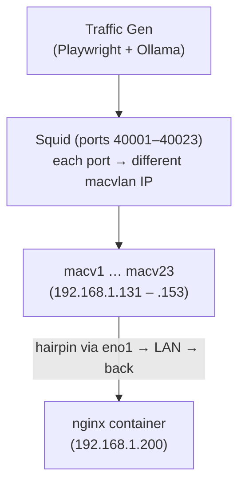

February 7, 10:24 PM. The DDoS lab's initial scaffold commits. February 8, 2:03 AM. The baseline lab commits — 2,425 lines of WordPress infrastructure and LLM-driven traffic generation. By the end of February 8, four repos have commits on the same day: Python adding batch 013, Rust adding Walkable and batch 013, the DDoS lab getting XDP sampling and a name, and the baseline lab switching its networking model before the day was out.

This is where the project gets hard to narrate linearly.

There's a practical reason for the context-switching: the infrastructure had to exist before the detection work could go anywhere real. Synthetic challenge data had taken the algebra as far as it could. The next step required actual packets on actual interfaces, which meant building the lab first. But there's a less tidy reason too. Feb 7–8 is a Saturday and Sunday — the first weekend I'd blocked out for all-day sessions on this. Three weeks of weekday evenings hadn't prepared me for what all-day LLM-assisted development actually feels like. It's fast in a way that's genuinely taxing — not in the way that debugging a gnarly pointer bug is taxing, but something stranger. The ideation loop runs so fast that comprehension starts to lag. You're not waiting for compilation; you're waiting for your own understanding to catch up with what just got built. I got a migraine at some point during this stretch from a full day of it. Bouncing between the DDoS lab scaffolding and the baseline traffic generator was partly practical and partly mental pacing — a different kind of constraint than I'd hit before.

What I can say a week later: it gets more manageable. The intensity of a full weekend at this pace is starting to feel like something I can hold. Whatever this new mode of working is, the muscle is already forming.

---

## Scaffolding a DDoS Lab

The Python challenge batches ran against synthetic data. Good for proving the algebra, but synthetic DDoS data has clean edges — the attack and baseline distributions don't overlap the way real traffic does. The lab needed real packets: a realistic L2 network, real protocol headers, real timing, and enough traffic volume to stress the XDP filter.

The initial scaffold (`e337525`) lands 1,243 lines across 14 files:

- `xdp-filter-ebpf/` — the eBPF/XDP program running in kernel space
- `xdp-filter/` — userspace loader with stats API
- `xdp-generator/` — raw socket traffic generator with spoofed source IPs
- `control-plane/` — Axum HTTP API for start/stop/stats
- `xtask/` — build helper for eBPF programs

The architecture at this point is straightforward: the XDP filter drops packets from `10.0.0.0/8` (the simulated attack range), the generator crafts SYN/UDP/ICMP floods with spoofed sources, and the HTTP API controls the whole thing. This isn't the final architecture — there's no Holon integration yet, no rule engine, no sidecar. It's the scaffolding that would eventually hold all of that.

Twenty-five minutes later (`e4ba90c5`): the generator is already being rewritten. The first attempt used raw IP sockets. It failed.

---

## Raw Sockets Don't Work for Spoofed Traffic

The failure is documented in `docs/PACKET_GENERATION_DEEP_DIVE.md` because it's a useful lesson. The attempt:

```rust
let fd = socket(AF_INET, SOCK_RAW, IPPROTO_RAW);
setsockopt(fd, IPPROTO_IP, IP_HDRINCL, &1);
setsockopt(fd, SOL_SOCKET, SO_BINDTODEVICE, "eno1");

// Craft packet with spoofed source IP
let packet = craft_ip_packet(src: "10.1.2.3", dst: "192.168.1.200", ...);
sendto(fd, &packet, ...);
```

`sendto()` returned success. Nothing appeared on the wire.

The reason: even with `IP_HDRINCL` and `SO_BINDTODEVICE`, the kernel's routing subsystem still makes decisions. When the source IP (`10.x.x.x`) doesn't match any local interface, the routing code drops the packet silently before it reaches the NIC. Disabling `rp_filter` and checking iptables ruled out the obvious suspects — it's the routing layer itself. The kernel expects source IPs to be "ours" even when crafting headers manually at the socket level.

The fix is `AF_PACKET` — layer 2 access, which bypasses the kernel's IP routing entirely:

```rust
let fd = socket(AF_PACKET, SOCK_RAW, ETH_P_IP.to_be());

let sll = sockaddr_ll {
    sll_family: AF_PACKET,
    sll_protocol: ETH_P_IP.to_be(),
    sll_ifindex: get_ifindex("macv1"),
    sll_halen: 6,
    sll_addr: dst_mac,
    ...
};
bind(fd, &sll, ...);

// Full Ethernet frame — kernel routing never sees this
let frame = craft_ethernet_frame(
    dst_mac: "aa:ee:10:e4:73:cc",
    src_mac: "c2:2e:3a:db:dd:fa",
    ethertype: 0x0800,
    payload: craft_ip_packet(src: "10.1.2.3", dst: "192.168.1.200", ...),
);
sendto(fd, &frame, &sll, ...);
```

Operating at layer 2 means constructing full Ethernet frames with correct source and destination MACs. The destination MAC is resolved from the ARP cache — incomplete ARP entries get skipped. The generator uses a macvlan interface (`macv1`) for hairpin routing: traffic sent through the macvlan exits via the physical NIC, hits the router, and comes back to the container on the same host. Without the hairpin the generator and the filter would never see the same packets.

---

## The Macvlan Hairpin

The networking architecture matters here because it comes up again with the baseline lab, and then gets changed.

A macvlan interface is a virtual NIC that shares the physical NIC's cable but gets its own MAC address. The OS sees it as a separate network interface. The trick for local packet injection: if you send a packet out through a macvlan interface, it goes to the physical NIC, onto the LAN, through the router's switching logic, and comes back to the machine's network stack — this time hitting the XDP filter attached to the same interface. The packet traveled through hardware to achieve what's effectively loopback, but with real L2/L3 headers.

The XDP filter at this stage is a stub — the eBPF toolchain has a compatibility issue with the `aya-ebpf` crate that gets fixed the next commit. The filter architecture is in place; the packets are flowing; the XDP attachment point is wired up. Good enough to commit.

---

## XDP Sampling, pcap, and a Name

The second DDoS lab commit (`85d4e80b`, timestamped 12:44 AM Feb 8) fixes the eBPF toolchain (`aya-ebpf 0.1.0` + `cty 0.2.1`), adds packet sampling via perf buffer, and gets to 45k PPS attack filtering with legitimate traffic captured separately.

The XDP perf buffer setup sends 256 bytes per sampled packet to userspace. The sidecar eventually needs those bytes to encode and analyze — this is the pipe that will feed the Holon integration. At this stage it's a `pcap_capture` binary that writes the samples to disk, and a `test_xdp` binary that monitors filter stats.

Also added: `sendmmsg` batching. Sending individual packets with `sendto()` hits a syscall per packet. `sendmmsg` sends up to 100 packets per syscall — the commit message says "100x fewer syscalls," which is the theoretical max; actual improvement depends on batch fill rate. At 45k PPS this matters.

At 12:49 AM: the repo gets its name. The commit message: "Rename to holon-lab-ddos, add Holon integration docs." The README now documents the planned sidecar architecture — Holon-rs encoding the sampled packets, VSA-based anomaly detection, rule generation feeding back to the XDP filter. This is the first place where the two repos (holon-rs and the DDoS lab) are explicitly linked in documentation, even though the integration won't land until February 9.

---

## The Baseline Lab

Building a DDoS detector requires two things: attack traffic and baseline traffic. The DDoS lab generates attacks. The baseline lab generates the normal.

The initial commit (`084da74b`, 2:03 AM) is 2,425 lines:

```
.env.example
NETWORKING.md
README.md
Dockerfile
docker-compose.yml
nginx-entrypoint.sh
nginx.conf
create_initial_posts.py
setup-squid-macvlans.sh
force-hairpin.sh
requirements.txt
wordpress_traffic_generator.py    (1,368 lines)
```

The stack: nginx + WordPress (PHP-FPM) + MariaDB on Docker. The traffic generator: Playwright + Ollama driving autonomous browser agents.

### Twenty-Three Source IPs

A DDoS detector trained only on single-source traffic would identify attacks trivially by source count. Real DDoS traffic comes from distributed sources — botnets, amplification reflectors, spoofed ranges. The baseline traffic needs to look equally distributed.

The solution is Squid proxy with 23 macvlan interfaces:



The Playwright agents route through different Squid ports — each port is bound to a different macvlan interface with a different LAN IP. From the nginx server's perspective, 23 different hosts are making requests. The policy routing in `force-hairpin.sh` ensures each macvlan IP has a dedicated routing table so traffic egresses through the correct interface.

### The Agents

The traffic generator runs two categories of agents concurrently:

**User agents** (20 agents): browse the site, read posts, submit comments. GET-heavy with occasional form POSTs. Their behavior is LLM-directed — Ollama decides what to read, what to comment, which links to follow. The navigation decisions come from a language model, not a round-robin script, so the request patterns have the irregular cadence of actual reading and decision-making.

**Admin agents** (3 agents): create posts with AI-generated content and AI-generated images, reply to comments, moderate the comment queue. Authenticated sessions throughout — login flows, CSRF tokens, multipart form submissions for image uploads. The write-side of a realistic CMS workload, with higher per-request payload sizes than anything the user agents produce.

All agents run through Playwright with a real browser distribution: 80% Chromium (Chrome/120 user-agent), 15% WebKit (Safari/17), 5% Firefox (Firefox/121). Each browser type gets its own Playwright instance; each agent gets a context within that instance routed through a distinct Squid port. The resulting HTTP traffic has realistic `User-Agent` headers, TLS fingerprints, and browser-specific request patterns — the full fingerprint, not just an agent string.

This matters more for L7 inspection than for the current DDoS work. The packet-level XDP filter doesn't see HTTP headers — it operates on IP/TCP/UDP fields only. But when the WAF layer arrives, the traffic corpus needs to look like real browser diversity, not a single tool making identical requests. That foundation is built in now.

The `wordpress_traffic_generator.py` is 1,368 lines. It handles session management, authentication state, CSRF tokens, form parsing, concurrent agent coordination, and the Ollama integration for behavioral content generation. This is not a simple HTTP benchmarking tool. It's an autonomous traffic corpus generator designed to produce traffic that a machine learning system would have trouble distinguishing from real users.

The intent: train the DDoS detector on traffic this complex, then see if it can distinguish an attack from this baseline at packet rates where inspecting HTTP bodies is impossible.

---

## macvlan → ipvlan

The baseline lab's second commit (`b178690c`, 13:37) swaps the network driver. The initial commit used macvlan. The switch is to ipvlan (L2 mode):

```
Replace macvlan with ipvlan (L2 mode) for Docker and host interfaces
New setup-ipvlan-squid.sh: idempotent, arp-scan based IP discovery
Hairpin routing via gateway for container access
```

The commit message explains why: "This enables XDP/AF_XDP attachment to `eno1` for packet inspection."

The thinking at this point: AF_XDP's zero-copy path requires attaching to the physical NIC directly, and macvlan's virtual driver doesn't expose the queue abstractions AF_XDP needs. ipvlan shares the parent interface's MAC address and sits closer to the underlying driver. The DDoS lab commit earlier that day had already noted `Add AF_XDP skeleton (blocked on macvlan)`. Switching to ipvlan on the baseline side looked like it would unblock that path.

It won't, as it turns out. AF_XDP is a different tool than what we need here — the full packet payload sampling we eventually build doesn't use AF_XDP at all. That realization comes later in the DDoS lab when the actual sampling architecture takes shape. At this point we're making a reasonable bet on the networking model based on a partially-formed understanding of the stack, and the ipvlan switch is the right move regardless of whether AF_XDP pans out.

---

## Walkable and Batch 013 Land in Both Languages

While the baseline lab was getting its networking sorted out, holon-rs was adding two things that closed out the day.

### The Walkable Trait

The first Walkable commit (`1b4d5af7`, 14:23) was described in the previous post — the trait itself. What the commit message adds:

```
Benchmarks:
- encode_walkable: ~6.2 µs/packet
- encoding_comparison: JSON ~6.5 µs vs Walkable ~6.9 µs

Detection quality unchanged:
- walkable_rate: 99.5% detection, 0% FPR
- walkable_detection: 100% recall, 4% FPR
```

Six minutes later (`c8dd423e`, 14:29): a zero-allocation visitor API on top of Walkable. The issue with the initial Walkable implementation is that `walk_map_items()` returns a `Box<dyn Iterator>` over `(&str, &dyn Walkable)` pairs — for flat structs, this allocates a `Vec` of `WalkableValue` items to iterate over. The visitor API eliminates that:

```rust
// Slow path: allocates Vec<WalkableValue>
fn walk_map_items(&self) -> Box<dyn Iterator<Item = (&str, &dyn Walkable)>>;

// Fast path: zero-allocation visitor
fn walk_map_visitor(&self, visitor: &mut dyn WalkVisitor);
fn has_fast_visitor(&self) -> bool { false }
```

Benchmark results (5 fields, 4096 dimensions):

| Path | Latency |
|------|---------|
| JSON | 6.23 µs |
| Walkable (slow) | 6.19 µs |
| Walkable (fast visitor) | 6.06 µs |

The fast path is ~2.7% faster than JSON. That's not a dramatic win, but the actual value is in what it eliminates: runtime JSON parse errors, `to_json()` string building in hot paths, and the loss of compile-time type checking. For the DDoS sidecar encoding packet structs on every sampled packet, those properties matter more than the 2.7%.

### Batch 013: Rate Limiting in Both Languages

Batch 013 is vector-derived rate limiting for DDoS mitigation. The Python commit landed Feb 8; the Rust port (`319753c8`, 15:48) follows a few hours later.

The demo runs against synthetic multi-phase attack traffic and asks three questions at once: what kind of attack is this, how hard is it hitting, and what rule would stop it?

**Pattern identification** comes from the accumulator. Encode each packet as a vector, accumulate over a time window. At the end of the window, compare the accumulated vector against known attack pattern prototypes using cosine similarity. The closest match identifies the attack type — DNS reflection, SYN flood, ICMP flood.

**Rule derivation** follows from the identified pattern. The accumulated vector encodes which fields dominated the traffic — source port, destination port, protocol, flags. Querying the accumulated vector — asking "is `src_port=53` present?" by checking similarity against the atom vector for that field-value pair — recovers the discriminating features: high similarity to `src_port=53` and `protocol=UDP` means DNS reflection. Those features compose directly into a filter rule:

```
DNS Reflection: src_port=53 AND protocol=UDP
SYN Flood:      dst_port=80 AND flags=S AND protocol=TCP
ICMP Flood:     protocol=ICMP AND icmp_type=8
```

The vector isn't just detecting the attack — it's producing the rule. No hardcoded field names, no threshold tuning. The rule emerges from what the accumulator learned.

**Rate estimation** is the third signal. `encode_log()` maps a packet rate onto a log-scaled vector (base 10, changed from natural log in this commit for consistency with Python). Binary search over that encoding recovers rates to ~3.6% error — the demo shows a true rate of 5,000 PPS decoded as 5,178 PPS. *This requires fixed time windows — you need a known interval to compute packets-per-second. The windowed approach works well and the rate recovery is accurate without ever being told what the true rate is. It stays in use in the DDoS lab for a while. When the decay model eventually arrives and replaces window batching with continuous per-packet accumulation, the rate decoding goes away — not because it was wrong, but because the decay model doesn't produce discrete windows to measure across.*

The example also tracks source IP cardinality via HyperLogLog — unique source IP count encoded as a vector signal alongside the rate estimate. That part is window-agnostic: HyperLogLog accumulates a running cardinality estimate in O(1) memory regardless of observation cadence. A DDoS amplification attack from a handful of reflectors looks very different from a distributed botnet flood — cardinality is a meaningful signal independent of rate. Whether this ends up wired into the sidecar is a later question.

This is the first challenge developed in parallel across both implementations from the start. Not a port of existing Python work — batch 013 landed in Python and Rust on the same day, from the same design. The sync pattern that started informally on Feb 8 held for the rest of the project.

---

## What February 7–8 Set Up

At the end of Feb 8:

- holon-lab-ddos has: AF_PACKET generator with spoofed source IPs, macvlan hairpin, XDP filter, perf buffer packet sampling, pcap capture, sendmmsg batching, a planned Holon integration architecture, and 45k PPS validated.
- holon-lab-baseline has: WordPress stack on Docker, 23 source IPs via Squid + ipvlan, LLM-driven user and admin agents, and hairpin routing.
- holon-rs has: Walkable with zero-allocation visitor path, batch 013 rate limiting, and detection numbers validated against Python.
- holon (Python) has: batch 013 rate limiting, Walkable interface mirror.

The DDoS lab and baseline lab have never talked to each other yet. There's no sidecar connecting the sampled packets from XDP to the Holon encoder. The rule generation pipeline doesn't exist. What exists is infrastructure — two traffic environments, a fast encoder, and a rate limiting demo that proves the algebra works on the right problem domain.

That integration starts the next day.

---

Next: February 9 — the veth lab, holon-rs integrated into the sidecar, and the first stress test: 1.3 million packets per second, 99.5% drop rate.
