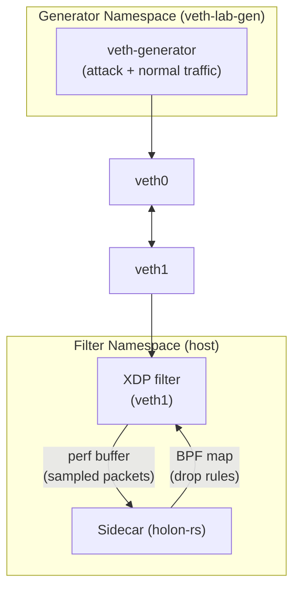
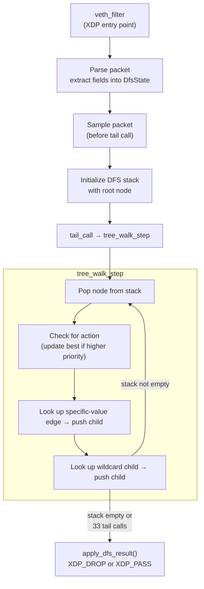

February 9, 6:47 PM. The veth lab commits — 2,873 lines, 20 files, holon-rs wired directly into an XDP sidecar for the first time. By 9:05 PM the same evening: 1.3 million packets per second, 99.5% drop rate, 316 million packets dropped in a single stress test.

By February 12 at 10:37 PM: 1,000,000 rules compiled into a BPF tail-call decision tree, enforced at line rate with ~5 tail calls per packet regardless of rule count.

Four days.

---

## The Veth Lab

The DDoS lab up to this point had two environments that didn't talk to each other. The original `holon-lab-ddos` repo had an XDP filter and traffic generator. holon-rs had benchmarks and examples. The sidecar — the piece that would connect Holon's VSA encoding to the XDP filtering decision — didn't exist yet.

The veth lab is where they connect.

The name comes from `veth` — virtual Ethernet pairs. A veth pair is two kernel network interfaces linked at the driver level: anything sent into one end comes out the other. Combined with network namespaces, you can build an isolated L2/L3 network entirely in software — no physical NIC required, no router needed, fully reproducible on any Linux machine. The veth lab creates this environment:



The generator lives in its own network namespace and sends traffic through the veth pair. The XDP program attaches to `veth1` on the filter side, sampling packets into a perf buffer. The sidecar reads from the perf buffer, encodes packets using holon-rs, runs drift detection, and pushes drop rules back to the XDP program via a BPF map. The XDP program enforces those rules at the kernel boundary — before the packet reaches userspace, before any socket, before any application code.

The initial commit (`f0d402d7`):

- `filter-ebpf/` — XDP program with dynamic rules, stats, packet sampling
- `filter/` — userspace library and CLI for managing the XDP program
- `generator/` — AF_PACKET traffic generator with attack/normal/mixed patterns
- `sidecar/` — holon-rs anomaly detection that pushes drop rules to XDP
- `scripts/` — setup, teardown, build, demo, status helpers

The initial test result is in the commit message: "Successfully detects and blocks attack traffic within 500ms, dropping 19,574 of 19,697 packets (99.4%) at XDP layer." That's the first number from an end-to-end system — Holon encoding → drift detection → rule derivation → XDP enforcement. Not a demo. Not synthetic challenge data. Packets on a virtual wire.

---

## The Sidecar Architecture

The sidecar is where VSA meets the kernel. Worth being precise about what it does.

The XDP program samples 1 in N packets (configurable) and pushes 256-byte truncated copies to userspace via a perf buffer. The sidecar reads these in batches, encodes each packet as a hypervector using holon-rs's `encode_walkable()` on the `PacketSample` struct:

```rust
struct PacketSample {
    src_ip: u32,
    dst_ip: u32,
    src_port: u16,
    dst_port: u16,
    protocol: u8,
    pkt_len: u16,
    // ...
}
```

The `PacketSample` implements `Walkable` — so encoding is zero-copy, no JSON serialization, no string allocation in the hot path. Each field-value pair becomes a bound atom in the hypervector.

The encoded vectors accumulate in a streaming accumulator. During warmup (configurable window), the sidecar builds a baseline prototype — what normal traffic looks like in vector space. After warmup, it freezes the baseline. From that point, every new accumulator window is compared against the frozen baseline via cosine similarity. When similarity drops below threshold — traffic has become structurally different from the baseline — an anomaly is flagged.

Baseline freezing after warmup is a key design decision in the stress test commit: without it, sustained attack traffic would gradually pollute the baseline, causing the detector to drift toward accepting attack patterns as normal.

Once an anomaly is confirmed, the sidecar queries the accumulated attack vector to identify which field-value pairs are dominating — the same probing technique from batch 013. The high-similarity fields become filter rule constraints. The rule gets pushed to the XDP program via a BPF map. The XDP program starts dropping matching packets at the kernel boundary.

---

## 1.3 Million Packets Per Second

The 1.3M PPS number was an accident. The generator had rate limiting code — it just didn't work correctly. The first test was supposed to be a controlled run, but the broken limiter let `sendmmsg` batches fly into the veth pair as fast as Linux would push them. We verified it wasn't a counter issue; the generator was genuinely emitting at that rate. Out of the gate, a buggy program accidentally stress-tested the system harder than we'd planned — and it held. The XDP filter dropped packets at kernel rate; the sidecar sampled, encoded, detected, and pushed rules.

The stress test commit (`743d28c8`, 9:05 PM the same day) documents what happened:

```
Test results:
- 52ms detection latency
- 316M packets dropped during stress test
- Zero false positives after attack
- Generator accuracy: 100% from 1k-200k PPS
```

316 million packets dropped in a single run. The XDP program handled the packet rate without issue — XDP operates before the kernel network stack, so 1.3M PPS is well within what a veth pair can push through. The harder problem was the sidecar: the vector operations can't run at line rate. Encoding a packet as a hypervector, accumulating, computing cosine similarity — that's microseconds per packet, which at 1.3M PPS means the sidecar falls behind immediately. The fix was sampling (1:N) and iterating on the perf buffer read path to avoid blocking. Non-blocking sample processing with bounded batches keeps the sidecar responsive without trying to encode every packet.

52ms detection latency. That's the time from when attack traffic starts to when the XDP drop rule is active — but it's a timing fluke, not a design guarantee. The system uses a 2-second accumulation window. The 52ms means the attack happened to start near the end of a window boundary, so the window closed quickly with enough attack signal to trigger detection. If the attack had started right after a window opened, detection would have taken closer to the full 2 seconds. Still: baseline freezing makes the signal sharp — when attack traffic starts, it immediately diverges from a frozen normal baseline rather than gradually polluting a live one — so detection within one window is reliable, even if the exact latency depends on when in the window the attack begins.

Once rate limiting was fixed in the same commit, the generator could hit any target from 1k to 200k PPS with 100% accuracy (measured via packet counters). Scenarios are JSON-defined multi-phase sequences — the 1.3M PPS stress test scenario was kept as a record of what the broken limiter had achieved:

```json
{
  "phases": [
    { "type": "normal", "duration": 10, "pps": 5000 },
    { "type": "attack", "duration": 30, "pps": 1300000 },
    { "type": "normal", "duration": 10, "pps": 5000 }
  ]
}
```

---

## The Visualization

February 10, 9:08 PM. The 3D visualization module commits to the Python repo — 4,280 lines across 6 files.

This is worth pausing on. The Python challenge batches had produced F1=1.0 anomaly detection numbers, and the veth lab had just shown the XDP integration working at 1.3M PPS. But all of that was numbers — cosine similarity dropping below threshold, rules firing, packets getting dropped. The prompt that produced the visualization module was something like: *I want to see into the machine.* Make the geometry observable rather than inferred.

The system:
- Encodes packets as 4096-dimensional hypervectors
- Projects them to 3D using random orthogonal projection (which preserves relative distances — nearby vectors in 4096D land near each other in 3D)
- Renders the 3D point cloud in a browser with an interactive rotatable view

Two modes:
- **Static explorer**: encode data structures and inspect where atoms, bindings, and composites land in the projected space
- **Streaming demo**: real-time anomaly detection visualization with dual-pane view — baseline evolution on the left, incoming traffic on the right

In the streaming demo, the detector runs the same algorithm as the veth lab sidecar: EMA warmup, baseline freeze, cosine similarity threshold (0.35). Attack patterns — SYN flood, UDP flood, ICMP flood — are generated in distinct phases.

What you see when you run it: synthetic attack traffic and synthetic normal traffic appear in dramatically separated regions of the projected space. Not close, not overlapping — separated. The attack cluster lands somewhere visibly distinct from the normal cluster. You can watch the separation happen in real time as the attack phase begins.

<video autoplay loop muted playsinline controls style="width: 100%; border-radius: 6px; margin: 1rem 0;">
  <source src="/vector-space-anomaly-detection.mp4" type="video/mp4" />
</video>

<p style="text-align: center;"><em>Left pane: the baseline accumulator evolving through 3D projected space during warmup, then freezing. Right pane: each incoming packet as atoms → bindings → composite, colored green to red by cosine similarity to the frozen baseline. Attack traffic lands in a visibly different region of the space.</em></p>

This wasn't a surprise given the detection results, but there's something different about *seeing* it. The visual separation made the geometric intuition concrete: normal traffic occupies a region of the space, attack traffic occupies a different region, and those regions are measurable and nameable. If you can name a region, you can snapshot it. If you can snapshot it, you can match against it later without re-learning.

That observation — that the clusters themselves were the primitive worth capturing, not just the similarity threshold — is what led directly to the engram concept. The engrams formalized what the visualization revealed. (The streaming demo video was added to the README on Feb 11.)

---

## Batch 014 and the Extended Primitives

The same day as the visualization, batch 014 commits to the Python repo — 3,055 lines, 497 tests passing.

Batch 014 is about explainability: once you've detected an anomaly, can you explain *what changed*? Nine new primitives:

- `unbind()` — explicit API for the self-inverse binding operation. Holon uses element-wise multiplication over bipolar `{-1, 0, 1}` vectors — multiplying by the same key vector undoes the bind. `unbind(bound, key)` is literally `bind(bound, key)`. This just names the operation explicitly rather than relying on callers to know they're identical.
- `similarity_profile()` — similarity expressed as a vector, not a scalar, enabling soft attention over multiple reference points
- `attend()` — soft attention with hard/soft/amplify modes; weight components by relevance before combining
- `segment()` — find behavioral breakpoints in a stream; where did traffic characteristics shift?
- `analogy()` — A:B::C:? relational transfer; given two paired examples, infer what a third maps to
- `project()` — subspace projection; how much of a vector lives in the span of a set of exemplars?
- `complexity()` — entropy/mixture measure (0.0–1.0); how uniform or diverse is the encoded traffic?
- `conditional_bind()` — gated binding by condition; only bind field B if field A is present
- `invert()` — reconstruct components from a learned codebook; given an accumulated vector, what atoms compose it?

The forensics demo (`001-explainable-anomaly-forensics.py`) chains these: detect → use `segment()` to find when the shift happened → use `invert()` to reconstruct what fields changed → use `attend()` to weight the most discriminating features → produce a human-readable explanation alongside the machine-generated filter rule.

These primitives also land in holon-rs on Feb 10 (`886d681b`), with a bipolar vector distribution fix (`a6e02cc4`) that corrects the vector type to `{-1, 0, 1}` — the `+1` in the distribution wasn't being generated. Fixed and validated before the day was out.

---

## holon-rs Integration and p0f Fields

February 11, 1:35 AM. The veth lab integrates holon-rs directly into the sidecar (`8d3a4998`). Previously the sidecar used a simpler encoding path; now it uses `encode_walkable()` with the `PacketSample` implementing Walkable, the same `$log` encoding for packet sizes, and the extended primitives from batch 014 — `similarity_profile()`, `segment()`, `invert()`, `analogy()` — all live in the detection loop.

The rate limiting from batch 013 also integrates here. The token bucket in the XDP program is now configured by the sidecar using a rate derived from vector magnitude comparison: the ratio of the accumulated attack magnitude to the accumulated baseline magnitude is used as a rate factor, throttling attack traffic down to a fraction of the baseline rate. The system detects the attack pattern, identifies the fields that distinguish it, derives the filter rule, *and* calculates how aggressively to rate-limit — all from the same vectors.

Verified result: correctly identifies attack traffic (`src_ip=10.0.0.100, dst_port=9999`) while preserving normal traffic (`dst_port=8888`), deriving ~2,000 PPS rate limit from vector magnitude comparison alone.

February 11, 10:05 PM. p0f-level fields added to the full pipeline (`ab4672606`). p0f is a passive OS fingerprinting tool — it identifies operating systems from TCP/IP stack characteristics without sending any probes. The fields it uses: TCP flags, TTL, DF bit, TCP window size. These are now in the `PacketSample`, extracted in the XDP program for sampled packets, encoded in the sidecar, and available for rule derivation.

Why this matters: TCP SYN floods and UDP amplification attacks have different OS fingerprints. A SYN flood from a spoofed source might craft packets with `flags=2, window=65535, TTL=128` — a Windows-like fingerprint. A UDP amplification attack from a DNS reflector typically has `TTL=255, DF=0` — a router fingerprint. The same packet rate but structurally distinct patterns. With p0f fields in the accumulator, the sidecar generates separate rules for each:

```
UDP amplification: (and (= proto 17) (= src-port 53) (= ttl 255) (= df-bit 0))
SYN flood:         (and (= proto 6) (= tcp-flags 2) (= tcp-window 65535) (= ttl 128))
```

Both rules coexist in the same decision tree. The system autonomously distinguished them from the vector algebra alone — no hardcoded protocol knowledge, no labeled examples.

---

## The Bitmask Rete — Fast, Capped at 64

The same evening as the p0f work (22:05), a discrimination network replaces the original flat HashMap approach (`ec20a627`). The flat approach was O(rules): N rules meant N map lookups per packet. The bitmask Rete is O(fields): six lookups regardless of rule count.

The idea: each dispatch map returns a 64-bit bitmask where bit N is set if rule N matches on that field. AND them together across all fields and the surviving bits identify rules that match everything:

```rust
let mut mask: u64 = ACTIVE_RULES.get(0);  // all active rules

// Narrow by each field — AND in the dispatch result for this packet's values
if let Some(m) = DISPATCH_PROTO.get(&proto) { mask &= m; }
if let Some(m) = DISPATCH_SRC_IP.get(&src_ip) { mask &= m; }
if let Some(m) = DISPATCH_DST_PORT.get(&dst_port) { mask &= m; }

// Surviving bits = rules matching ALL checked fields
```

Six map lookups, compound rules, O(fields) evaluation. The eBPF verifier has no trouble with this — six sequential map lookups is trivially verified.

**The wall:** 64-bit bitmask = 64 rules maximum. Not 100K. Not 1M. The goal was always a million rules. This validated the discrimination network principle but was a dead end for scale.

Rules ship as s-expressions in Clara-style LHS ⇒ RHS form, matching the Rete lineage this is drawing from:

```
((and (= proto 17)
      (= src-port 53))
 =>
 (rate-limit 1234))
```

---

## 1,000,000 Rules at Line Rate

February 12, 10:37 PM. The BPF tail-call DFS architecture (`de755615`). This one took hours and it wasn't obvious it would work at all. People who know this domain well said it couldn't be done — the verifier constraints are real, the instruction limits are real, the 33 tail-call ceiling is real. The consensus was that a DFS traversal of an arbitrary rule tree in the XDP call path was incompatible with what the verifier allows. Part of what made the approach viable: the entire DAG lives in BPF maps — `TREE_NODES` and `TREE_EDGES` are just hash maps the kernel already knows how to query. The walker doesn't carry the structure, it navigates it.

The path to get here is worth documenting because the eBPF verifier is not like any other runtime constraint. It doesn't just check that your program probably works — it explores *every possible execution path* and proves none of them can crash the kernel. A program with 20 loop iterations and 3 branches per iteration has 3²⁰ ≈ 3.5 billion potential paths to verify. The verifier gives up at 1 million.

**First attempt: decision tree with macro-unrolled levels (Chapter 3)**

Replace the 64-rule bitmask with a trie. Each internal node is a field dimension; edges are field values. A packet walks root-to-leaf following matching edges. Wildcards are handled by the compiler replicating rules into every value's subtree. The traversal:

```
Proto → SrcIp → DstIp → L4Word0 (src-port) → L4Word1 (dst-port) →
  TcpFlags → Ttl → DfBit → TcpWindow
```

The loop would hit the verifier, so unroll it with a macro:

```rust
macro_rules! tree_walk_level {
    ($node_id:expr, $field_value:expr) => {
        if let Some(node) = TREE_NODES.get($node_id) {
            if node.has_action && node.priority > best_prio {
                best_action = node.action;
                best_prio = node.priority;
            }
            let edge_key = EdgeKey { parent: $node_id, value: $field_value };
            if let Some(child) = TREE_EDGES.get(&edge_key) {
                $node_id = *child;
            } else if node.wildcard_child != 0 {
                $node_id = node.wildcard_child;
            }
        }
    };
}
// Nine expansions — straight-line code, verifier is happy
tree_walk_level!(node_id, proto);
tree_walk_level!(node_id, src_ip);
// ... through tcp_window
```

~270 instructions, verifier happy, works up to 10K rules. **Problem:** single-path traversal only follows one branch per level. Wildcard rules must be replicated by the compiler into every specific-value subtree, which explodes node count.

**Second attempt: multi-cursor DFS (Chapter 4)**

Track multiple cursors simultaneously, one for the specific-value path and one for the wildcard path. With 3 cursors and 9 levels, the verifier sees 2^(3×9) = 134 billion potential paths. Even MAX_CURSORS=2 hit the 1M instruction limit. The verifier doesn't know most paths are impossible — it checks them all.

**Third attempt: stack-based DFS in a single program (Chapter 5)**

Use an explicit stack and a bounded `for` loop. Push both children for each node; pop and process. Elegant, correct. Three verifier battles just to get it running:

- `while top > 0` → verifier can't prove termination → fix: `for _iter in 0..20`
- `stack[top]` where top is a variable → verifier can't prove bounds → fix: `stack[top & 0xF]` (bitmask proves 0–15)
- Field dispatch inside the loop → 9-way branch × 20 iterations = path explosion → fix: pre-extract all 9 fields into an array before the loop, then `fields[node.dimension]` is a single bounded lookup

Still hit the limit. Even with all fixes, 20 iterations × 2 map lookups each generates ~400K verified paths. The verifier has to check "map returns Some" vs "returns None" at every iteration. A loop with conditional map lookups inside is fundamentally incompatible with the BPF verifier at this depth.

**The breakthrough: BPF tail calls (Chapter 6)**

Split the DFS across multiple programs. Each tail call is a separate eBPF program verified independently. The verifier sees ~100 instructions per step, not the whole DFS.



Each tail call starts with a completely fresh stack — no local variables survive the jump. This is by design: it's what lets the verifier treat each program independently. But it means the DFS needs somewhere else to keep its state. The answer is a BPF per-CPU map: `TREE_DFS_STATE` is a `PerCpuArray` where index 0 holds a `DfsState` struct. `veth_filter` writes the initial state into it before the tail call; `tree_walk_step` reads it, pops a node, pushes children, writes the updated state back, then tail-calls itself again. The per-CPU part matters: each CPU core processes packets independently, so there's no contention on the state slot — core N always reads and writes its own copy.

The struct itself:

```rust
pub struct DfsState {
    pub stack: [u32; 16],   // DFS node stack
    pub top: u32,           // stack pointer
    pub fields: [u32; 16],  // pre-extracted packet field values
    pub best_action: u8,
    pub best_prio: u8,
    pub best_rule_id: u32,
    // ...
}
```

Three more verifier battles on the tail-call path:

- Writing `state.stack = [0u32; 16]` in Rust compiles to a `memset` call. In BPF, a function call means the compiler saves all live registers to the stack before the call and restores them after — that's ~30 extra instructions per call. Two array initializations plus `veth_filter`'s existing code pushed past the instruction limit. Fix: write every field out explicitly — `state.stack[0] = root; state.top = 1; state.fields[0] = fields[0];` and so on for all 9 fields. Verbose, but each line is a single BPF store instruction with no call overhead.
- The initial `tree_walk_step` tried to call `sample_packet()` to copy packet bytes to userspace. The BPF verifier requires every raw packet pointer access to be preceded by a bounds check: `if data + offset > data_end { return; }`. Those checks happen in `veth_filter` when the packet first arrives. But when a tail call jumps to `tree_walk_step`, the verifier treats it as a completely fresh program — the bounds checks from `veth_filter` are gone, and `tree_walk_step` has no packet context at all. Any attempt to read `ctx.data()` fails verification: "R4 offset is outside of the packet." Fix: move all packet access into `veth_filter` before the tail call. `tree_walk_step` never touches raw packet data — it only reads from BPF maps (`TREE_DFS_STATE`, `TREE_NODES`, `TREE_EDGES`), which don't require bounds checks. Cleaner separation of concerns as a side effect.
- After a tail call, if the target program isn't loaded, `bpf_tail_call` falls through to the next instruction instead of jumping. The verifier sees two possible paths: the tail call succeeds (program jumps away, this code never runs) and the tail call fails (execution continues here). It merges the register state from both paths at the fallthrough point — but after a tail call, registers may be clobbered. Code after the tail call that assumed registers still held valid values would get "R7 invalid mem access 'scalar'". Fix: explicit `return` immediately after the tail call. The fallthrough path returns immediately, nothing after it runs, no register state to merge.

Then: programs load, no verifier errors, no crashes.

No drops.

Hours of fighting the verifier, pushing back on LLMs suggesting we abandon the approach entirely — and when it finally loads clean, attack traffic passes through completely unmitigated. A working program that does nothing.

The first instinct: add counters. Not one round of counters — iterative rounds. Add counters for tail call attempts, add counters for node lookups, add counters for stack pops, rebuild, redeploy, read the maps. The tail call attempt counter read zero. Not "tail calls happening but failing to match" — zero attempts. `bpf_tail_call` doesn't return an error code; it either jumps or falls through with the same return value as success. From inside the program you can't tell which happened. The zero counter said something was wrong before the first tail call, but not what.

Next: `bpftool`. Install it, dump the loaded programs, dump the maps. The program array map was there. Its contents were not:

```bash
$ sudo bpftool map dump id 1449
Found 0 elements
```

The `ProgramArray` was empty. The setup code had used aya's `bpf.take_map("TREE_WALK_PROG")` — which removes the map from aya's internal registry and hands ownership to the caller. A `ProgramArray` was created from it, `prog_array.set(0, &tree_walk_fd, 0)` succeeded, and then `prog_array` went out of scope at the end of the initialization block. Rust dropped it. Dropping a `ProgramArray` closes its file descriptor.

In the Linux kernel, a BPF map's *existence* is reference-counted by the programs that reference it — so the map itself stayed alive. But a prog_array's *entries* are reference-counted separately: each entry holds a reference to the loaded program via the userspace fd. When the last userspace fd to the prog_array closes, the kernel clears all its entries. The map was still there. Its contents were gone.

The fix: store `prog_array` in the `VethFilter` struct with a leading underscore — Rust's convention for "I'm keeping this alive intentionally, not using it directly":

```rust
pub struct VethFilter {
    bpf: Arc<RwLock<Ebpf>>,
    /// Keep the prog_array alive so tail-call entries persist.
    /// Dropping this closes the fd, which clears the prog_array entries.
    _prog_array: Option<ProgramArray<MapData>>,
}
```

The underscore tells both Rust and the reader: this field exists purely to keep something alive. `VethFilter` lives for the program's lifetime, so the `ProgramArray` does too, so the prog_array entries survive, so tail calls work.

One field addition. Hours of debugging. `bpftool` saved it.

Proven at 1,000,000 rules:

```
1,000,000 rules → 2M nodes, 3.8s compile, 677ms parse
~5 tail calls/packet
3.9M drops
Detection + mitigation fully operational
```

O(depth), not O(rules). The depth is bounded by field dimensions (9), so worst case is 9 tail calls regardless of whether there are 10 rules or 10 million.

Rule updates are atomic via blue/green deployment: the compiler maintains two tree slots (250K nodes × 2). New rules compile into the inactive slot; a single atomic flip of `TREE_ROOT` makes it live. Packets in flight see either the old tree or the new tree — never a partially-written one. Zero packet drop during rule updates.

### The DAG Compiler

The part that makes 1M rules feasible isn't the XDP walker — it's the DAG compiler that produces the tree.

The naive approach: one path per rule, root to leaf. 1M rules = 1M paths = many millions of nodes. Doesn't fit in kernel memory, doesn't compile in acceptable time.

The actual approach: a directed acyclic graph where identical subtrees are shared. The compiler builds the tree recursively by dimension: take a set of rules, partition them by their constraint on the first unprocessed dimension, recurse on each partition. Two partitions with identical remaining constraint sets produce identical subtrees — `Rc<ShadowNode>` lets them share a single node. Content-hash deduplication catches this: if two recursive calls produce the same canonical rule hash at the same dimension index, the result is memoized and reused.

This is the Rete beta network, compiled at rule-load time rather than evaluated at packet time. In Forgy's original Rete formulation, the beta network joins partial matches across conditions as facts arrive — expensive at runtime. Here, all rules are known upfront, so we pre-compute the entire join structure once and bake it into the tree. The XDP walker is the alpha network — it traverses the pre-joined result, testing one field per level, sharing nodes when multiple rules test the same condition. One traversal per packet, regardless of how many rules contributed to the structure.

The measured scaling:

| Rules | Compile | Nodes | Notes |
|-------|---------|-------|-------|
| 10,000 | ~40ms | ~20K | |
| 50,000 | ~90ms | ~100K | 0.04ms/rule |
| 1,000,000 | 2,867ms | ~2M | 0.003ms/rule — DAG sharing improves at scale |

At 1M rules, compile time is 2.9 seconds and node count is ~2M — approximately 2 nodes per rule. Without DAG sharing, 1M 3-constraint rules would naively produce ~3M nodes minimum. The sharing reduces this, and more importantly caps the *per-packet* cost: the tree gets wider at each level, but it doesn't get deeper.

The answer turned out to be: split the problem correctly. The compiler does the expensive join work once in userspace. The kernel does only the fast traversal work, one step per tail call, with no branching inside each step that would explode the verifier's path count. The constraint that seemed prohibitive — "you can't have complex loops in BPF" — is actually fine once you accept that the loop runs across tail calls rather than within a single program.

Every constraint the verifier imposed forced a better design: pre-extracting fields eliminated per-iteration branching, tail calls produced independently verified modules, moving packet access before the tail call produced cleaner separation of concerns. The six-constraint SYN flood rule that comes out the other end:

```
((and (= tcp-flags 2)
      (= tcp-window 65535)
      (= proto 6)
      (= src-addr 10.0.0.100)
      (= dst-port 9999)
      (= ttl 128))
 =>
 (drop))
```

Five tail calls per packet. A million rules. Line rate. Rete split across userspace and kernel, with rules derived autonomously from hyperdimensional vector analysis — no human writing filter rules, no training data, no labeled examples.

### Likely Contributions to the Field

The same caveat as the primer posts: we haven't done an exhaustive literature survey, and we'd genuinely want to know if this maps to existing published work.

**Rete discrimination network inside eBPF.** We haven't found documented examples of a full Rete-style discrimination network — alpha network in kernel, beta network compiled in userspace, conflict resolution by priority — operating inside eBPF/XDP at line rate. The individual techniques exist (BPF tail calls, decision trees, hash map dispatch), but their composition into a Rete architecture with DAG-compiled rule sharing, blue/green atomic deployment, and autonomous rule derivation from VSA appears to be novel.

**The tree's nature is worth calling out explicitly:** irrelevant branches are never reached. A million rules with dense overlap share structure at every level — the tree doesn't evaluate rules, it prunes the space. For L3/L4 packet fields this is already powerful. For L7 inspection (HTTP headers, URI patterns, request bodies), where the rule density and field cardinality are orders of magnitude higher, the same architecture could evaluate WAF-scale rule sets at depths that traditional linear-scan engines can't touch. The L7 work hasn't started yet.

---

## What February 9–12 Established

At the end of Feb 12:

- The veth lab has: full end-to-end pipeline (XDP → perf buffer → sidecar → holon-rs encode → drift detection → rule derivation → BPF map → XDP enforce), 52ms detection, 1.3M PPS stress-tested, 99.5% drop rate.
- The rule engine has: tree Rete with blue/green atomic deployment, p0f-level field fingerprinting, s-expression rule format, and BPF tail-call DFS proven at 1M rules with O(depth) per-packet cost.
- The Python library has: 9 new forensics primitives, 497 tests passing, a 3D visualization that made the geometric separation visible.
- holon-rs has: extended primitives, bipolar vector distribution fix, rate limiting integrated into the live sidecar.

The visualization moment is worth naming explicitly: seeing attack and normal traffic in separated regions of 3D projected space is what made the engram idea inevitable. If a cluster of vectors occupies a recognizable region, you can mint a snapshot of that region. If you can mint a snapshot, you can match against it in a single packet instead of waiting for an accumulator to rebuild signal. That's the path from 750ms to 3ms — but that realization is still a week away.

---

Next: February 13–16 — the EDN rule language, streaming metrics dashboard, 2048-byte L4 payload analysis, and the decay model that establishes the 750ms detection baseline.
