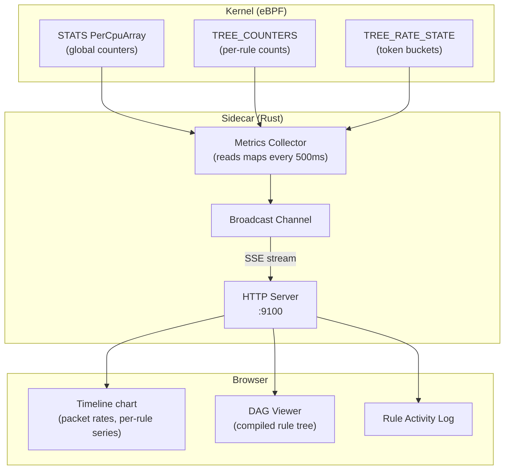

February 13, 1M rules proven and still accelerating. The BPF tail-call DFS committed at 10:37 PM on the 12th. By February 16 at end of day: full 2048-byte L4 payload analysis, byte-match rule derivation, real-time dashboard with live DAG visualization, 6 new IP header fingerprinting dimensions, and the decay model that replaces fixed windows entirely — a continuous per-packet accumulator that becomes the 750ms detection baseline that everything else is measured against.

Four more days.

---

## EDN: The Rule Language

The first thing February 13 brings is a new format for rules. EDN (Extensible Data Notation — Clojure's data format, a superset of JSON's semantics with cleaner syntax) replaces JSON. Honest admission: this was a biased choice. The s-expression predicate syntax already looked Clojure-idiomatic; EDN was a natural fit. The practical justifications followed — and they're real, but they weren't what drove it.

The streaming requirement is genuine: at 1M rules, loading a 149MB JSON array into memory before parsing the first rule is wasteful. Line-delimited EDN (one rule per line) streams incrementally — parse, compile, next line. You could achieve the same with newline-delimited JSON objects instead of a JSON array, and it would work fine. But EDN also gives you native `;;` comments and cleaner keyword syntax, and the rule format already looked like Clojure. The choice was made. At 1M rules:

| Metric | JSON | EDN |
|--------|------|-----|
| File size (10K rules) | 1.5 MB | 0.9 MB |
| Parse strategy | Load full file | Stream line-by-line |
| Memory at 1M rules | ~150 MB peak | Minimal (one line at a time) |
| Comments | No | `;;` native |

A DNS amplification mitigation rule in EDN:

```edn
;; Block DNS reflectors — TTL=255, DF=0 is the reflector fingerprint
{:constraints [(= proto 17) (= src-port 53) (= ttl 255) (= df 0)]
 :actions     [(rate-limit 500 :name ["ddos" "dns-amp"])]
 :priority    200}
```

The Clara connection is explicit in the syntax — `:constraints`, `:actions`, keyword fields. The s-expression predicates inside `:constraints` are the same format as the pretty-printed rule output. A rule looks the same whether you wrote it by hand, loaded it from a file, or the sidecar derived it from vector analysis and logged it.

The same day: the flat bitmask Rete engine and legacy JSON flat rules are removed. The tree is the only path now.

---

## Beyond Equality: Predicates

The initial rule language had one predicate type: equality. `(= proto 17)`. That's enough for exact field matching but misses entire attack classes that require range or bitmask logic.

February 13–14 adds three new predicate families:

**Range predicates.** TTL ranges, port ranges, packet length bounds:

```edn
(> ttl 200)        ;; amplification reflectors (TTL near 255)
(< ip-len 40)      ;; tiny/malformed packets
(>= dst-port 1024) ;; ephemeral port range
(<= ttl 64)        ;; Linux/VPS origin
```

These evaluate as guard edges in the tree — the node checks the inequality at traversal time without expanding the rule into multiple equality branches. No tree bloat.

**Bitmask predicates.** OS fingerprinting via TCP flags and protocol fields requires bit-level matching, not exact values:

```edn
(mask-eq ttl 0xF0 0x40)         ;; upper nibble of TTL = 4 (64-79 range)
(tcp-flags-match 0x02 0x02)     ;; SYN bit set (other bits don't care)
(protocol-match 17 0xFF)        ;; exact UDP match via mask
```

The semantics: `(value & mask) == expected`. A SYN flood filter cares that the SYN bit is set — it doesn't care about the other flags. Bitmask matching expresses this without replicating the rule for every combination.

**L4 byte matching.** The deepest predicate: arbitrary byte patterns at transport-layer offsets, with masks for don't-care positions:

```edn
;; Match "VETH-LAB-TEST" at L4 offset 8
(l4-match 8 "564554482D4C41422D54455354" "FFFFFFFFFFFFFFFFFFFFFFFFFF")

;; Match payload starting with DEADBEEF, with a don't-care gap, then CAFEF00D
(l4-match 4 "deadbeef00000000cafef00d" "ffffffff00000000ffffffff")
```

The mask enables sparse matching — check only the bytes that matter, skip variable fields like sequence numbers or session IDs. This is how application-layer attacks get caught at XDP speeds: the rule doesn't parse HTTP, it matches the byte signature of whatever the attacker is sending.

Short matches (1–4 bytes) use a custom dimension fan-out for O(1) tree lookup. Long matches (5–64 bytes) use pattern guards evaluated at traversal time. Both live in the same tree, evaluated in the same DFS pass.

Named rate limiter buckets also land here — multiple rules can share a single token bucket via a `["namespace" "name"]` tuple:

```edn
{:constraints [(= src-addr "10.0.0.1")] :actions [(rate-limit 1000 :name ["ddos" "dns-amp"])]}
{:constraints [(= src-addr "10.0.0.2")] :actions [(rate-limit 1000 :name ["ddos" "dns-amp"])]}
;; Both rules throttle to a shared 1000 PPS budget
```

A tenant with multiple source IPs in an amplification attack gets rate-limited in aggregate, not per-source. The two-tuple structure is deliberate: this mirrors how production metrics and observability systems work — namespace/name pairs map cleanly to Prometheus label pairs, Datadog tag structures, StatsD namespacing. The namespace is structured data, not a flat string. `["acct-12345" "syn-flood"]` gives a customer-scoped counter for a specific attack type. That's a different shape than `"acct-12345/syn-flood"` embedded in a string — when this connects to a real metrics pipeline, the cardinality is already decomposed. The tuple can grow into richer structure later without breaking existing consumers.

---

## The Dashboard

February 14. A real-time metrics dashboard ships alongside the predicate work — a single HTML file served from the sidecar's axum HTTP server, no build tools, no bundler.

The architecture is clean:



Three panels:

**Timeline**: packets/sec broken down into passed, dropped, and rate-limited — plus per-rule trendlines for the top 5 active rules. A 2-minute rolling window at 500ms intervals. You can watch a rule activate: the line appears, the drop rate climbs, the attack traffic falls.

**DAG Viewer**: interactive visualization of the live compiled eBPF filter tree. Clickable nodes show dimension, match value, fan-out, and the original EDN expression. Leaf nodes show the action — rate-limit, drop, count. Updates live on every rule recompilation. This is the first time you can see inside the BPF maps as a readable structure rather than raw hex.

**Rule Activity Log**: scrolling lifecycle events — rule added, refreshed, expired — with the full EDN expression and timestamps. Detection → rule appears → tree recompiles → DAG updates. The latency from anomaly to rule visible in the DAG is typically under a second.

<video autoplay loop muted playsinline controls style="width: 100%; border-radius: 6px; margin: 1rem 0;">
  <source src="/rule-engine-preloaded-and-derived-rules.mp4" type="video/mp4" />
</video>

<p style="text-align: center;"><em>The metrics dashboard running with a mix of preloaded rules and autonomously derived rules. Timeline shows passed, dropped, and rate-limited packet rates with per-rule trendlines. The DAG viewer on the right reflects the live compiled eBPF filter tree — updating in real time as new rules are derived and compiled in.</em></p>

The dashboard immediately surfaced bugs that would have been invisible in log files. Two in particular:

**Sawtooth flapping in rate-limited packet counts** (`3a05abd`). System-generated detection rules had unnamed actions, which caused `bucket_key()` to fall back to the canonical rule hash — a hash that includes the PPS value. Every detection window adjusts the derived rate slightly, producing a new bucket ID each time. That destroyed the old token bucket and created a fresh one with a full token count, releasing a burst of packets every ~2 seconds. On the dashboard it appeared as a repeating spike in the rate-limited series, not the smooth throttle the design intended. The fix: give system-generated rules a stable `:name` derived from their constraints (not their rate), and update `rate_pps` in-place on existing buckets rather than recreating them.

**Compound range predicates silently dropping half their constraints** (`573a98f`). A rule like `(>= ip-id 1000) (<= ip-id 2000)` is a range — both constraints must hold. The tree compiler extracted only the first range predicate per dimension and advanced past the second, silently dropping it. `(>= ip-id 1000)` matched ~98.5% of traffic. `(>= ip-id 1000) AND (<= ip-id 2000)` matches ~1.5%. The dashboard showed the rule firing on nearly everything — visually obvious once you're watching per-rule trendlines in real time, invisible in packet counters alone. Also in this commit: the token bucket itself had millisecond-granularity precision loss. Sub-millisecond remainders were discarded on every packet, causing cumulative drift at high packet rates. Replaced with a nanosecond credit accumulator that carries exact fractional remainders across packets.

Both bugs existed in the code before the dashboard. The dashboard made them show up as patterns rather than noise.

One design decision worth noting: per-rule counters reset when dynamic rules are recompiled (the old token bucket is destroyed and recreated). The dashboard tracks cumulative counts by capturing the final count of each retiring bucket and adding it as a persistent offset to the new one. Every counter is monotonically increasing from the browser's perspective, regardless of how many recompilations happen underneath.

---

## IPv4 Header Fingerprinting

February 15. Six new dimensions added to the detection pipeline — IPv4 header fields beyond the original nine:

| Field | Range | Use |
|-------|-------|-----|
| `ip-id` | 0–65535 | OS fingerprinting: 0=spoofed, random=Windows, sequential=Linux |
| `ip-len` | 20–65535 | Flood detection: tiny (<40) or jumbo (>1500) packets |
| `dscp` | 0–63 | QoS abuse: DSCP 46 (voice class) on data traffic |
| `ecn` | 0–3 | Congestion manipulation |
| `mf-bit` | 0–1 | Fragment flood: sustained MF=1 |
| `frag-offset` | 0–8191 | Evasion: offset>0 bypasses L4 matching |

What makes this notable isn't the fields themselves — it's what adding them required:

The detection code didn't change. The `PacketSample` struct got six new fields. The `extract_all_fields()` function in XDP got ~10 new instructions. The `Walkable` implementation picked them up automatically. The concentration analysis is field-agnostic — it doesn't know or care what `ip_id` is, it just notices when 70% of packets have the same value. The rule compiler maps them to predicates via a `to_constraint()` lookup. That's it.

Live test: a Windows baseline (TTL=128, random IP ID), then a Linux botnet attack (TTL=64, sequential IP ID in 1000–2000 range), then a spoofed-source attack (IP ID=0, DF=0):

```
Window 59: drift=0.714
>>> ANOMALY DETECTED
    Concentrated: ip_id=0 (70.4%)
    Concentrated: dscp=46 (70.4%)
    Concentrated: df_bit=0 (70.4%)
    ...
```

Autonomously generated compound rule:

```edn
{:constraints [(= src-addr 10.0.0.100)
               (= ttl 64)
               (= df 0)
               (= ip-id 0)
               (= dscp 46)]
 :actions     [(rate-limit 2104 :name ["system" "..."])]}
```

Two of the six constraints came from the new fields. Zero changes to the detection algorithm.

This is worth sitting with. A traditional detection system is code-first: you add a new field, then you write code to extract it, write code to reason about it, write detection rules that reference it, write tests for all of that. The field and the logic are coupled. Here the field was added to `PacketSample`, the `Walkable` implementation picked it up, concentration analysis noticed it was 70% uniform during the attack, and the rule compiler turned that into a constraint. The detector never learned anything new — it was already general. The field just became a new dimension in the space the detector was already watching.

That's what data-first means in practice: the abstraction boundary is at the data, not the logic. Adding signal doesn't touch behavior. The behavior was already written for arbitrary signal.

---

## Full L4 Payload Analysis

February 15–16. The XDP program already captured 256 bytes of payload per sampled packet. A new commit expands this to **2048 bytes** and wires it to a `PayloadTracker` that learns what normal L4 payloads look like and derives byte-match rules when they change.

The mechanism:

1. Each packet's L4 payload is sliced into **32 windows of 64 bytes**
2. Each window is encoded as a VSA vector: byte position `p0`..`p63` bound with hex values `0xde`, `0x41`, etc. — the same Walkable encoding used for packet headers, applied to raw bytes
3. Vectors accumulate across warmup packets into per-window baselines
4. After freeze: each incoming window is similarity-scored against its baseline vector
5. A window below threshold → payload is anomalous

The threshold auto-calibrates: after warmup, stored warmup payloads are replayed, mean and standard deviation of minimum similarities computed, threshold set at `mean - 3σ` (clamped). No manual tuning.

Rule derivation when anomaly count exceeds threshold:

1. **Drill-down**: for each anomalous window, probe byte-position vectors against the baseline. Positions with similarity < 0.005 are "unfamiliar" — the attack's fingerprint
2. **Gap probing**: extend detected positions ±4 neighbors, filter to bytes never seen in legitimate traffic
3. **Scoring**: consensus byte, consensus rate (≥50% of attack samples), penalties for familiar or zero bytes
4. **Assembly**: group nearby high-scoring positions into contiguous spans with masks for gaps

The result is a sparse `l4-match` rule:

```edn
{:constraints [(= dst-addr 10.0.0.1)
               (l4-match 4 "deadbeef00000000cafef00d" "ffffffff00000000ffffffff")]
 :actions [(rate-limit 500 :name ["system" "payload_l4match_..."])]}
```

The mask tells the eBPF filter: check bytes 4–7 (`DEADBEEF`), skip bytes 8–11 (don't care), check bytes 12–15 (`CAFEF00D`). Variable fields in the middle — sequence numbers, session IDs — don't interfere.

Five distinct attack patterns tested in one scenario: fixed 4-byte signature, scattered bytes at non-contiguous positions, deep-offset shellcode (beyond the first 64-byte window), sandwich patterns (unfamiliar prefix + familiar middle + unfamiliar suffix), and a 16-byte constant signature. All five detected. Recovery phases between attacks verify no false positives on returning legitimate traffic.

The payload analysis work happened in parallel across all three codebases: batch 016 in Python (windowed payload analysis with byte match rule derivation), holon-rs examples for payload anomaly detection and byte match derivation, and the DDoS lab's `PayloadTracker` integrating both into the live sidecar. The same sync pattern from earlier in the project — anything useful in one repo gets ported to the others immediately.

Also on Feb 15: the perf buffer for packet sampling was replaced with BPF RingBuf (`e41faa2`). RingBuf avoids the per-event wakeup overhead of PerfEventArray and handles variable-length data more cleanly — the expanded 2048-byte payload samples that the payload tracker needs would have been wasteful at fixed-size perf events.

---

## The Decay Model

February 16. The architecture change that establishes the 750ms baseline.

Everything up to this point used fixed windows: accumulate for 2 seconds, compare against baseline, reset, repeat. This works — the veth lab stress test proved it — but it has a fundamental constraint: detection latency depends on where in the window the attack starts. Worst case: attack begins right after a window opens, detection waits the full 2 seconds. The 52ms number from the stress test was a timing fluke, not a design property.

The decay model eliminates windows. Instead of batch accumulation, each packet is processed immediately with exponential decay applied before every addition.

Two accumulators, each with the right decay model for its purpose:

**Direction accumulator** (`recent_acc`) — per-packet decay:

```
For each packet:
    recent_acc *= alpha          # decay by fixed factor per packet
    recent_acc += encode(packet) # add at full weight
```

The decay factor `alpha = 0.5^(1/half_life)` where half-life is in packets. At steady state, magnitude converges to the same value regardless of traffic rate — `1/(1-alpha)` effective observations. This is the right model for *what* traffic looks like: whether it's 1K or 10K PPS, the drift score reflects the pattern, not the volume. A 10x spike with the same distribution should drift ≈ 1.0, not trigger a false positive.

**Rate accumulator** (`rate_acc`) — time-based decay:

```
For each packet:
    dt = now - last_update
    rate_acc *= e^(-lambda * dt)  # decay by wall-clock time
    rate_acc += encode(packet)
```

Decay constant `lambda = ln(2) / half_life_seconds`. At steady state, magnitude is proportional to PPS. Double the traffic, double the magnitude. This accumulator encodes both pattern (direction) and volume (magnitude) in the same vector. A single artifact that a fleet scrubber can distribute: this is what the traffic looks like and how much there is, in one vector.

Analysis no longer happens on window boundaries. A hybrid trigger fires when either condition is met: N packets processed (default 200) or T milliseconds elapsed (default 200ms). At baseline ~3K PPS with 1:100 sampling, the time trigger dominates (~5 analysis ticks/second). Under heavy attack at 30K PPS, the packet trigger fires more often. The system stays responsive at both ends without wasting cycles.

Warmup is now packet-count driven (default 200 packets), not window-count driven. The direction accumulator runs without decay during warmup for a clean baseline. The rate accumulator runs with time-based decay from the start so it reaches steady state before freeze. On freeze, the direction accumulator is normalized to a bipolar baseline vector. The rate accumulator is not cleared — it's already at steady state.

Why this architecture matters: the windowed approach was fundamentally reactive. It could only detect an attack after a full window of signal accumulated. The decay model is continuous — every packet updates the accumulator, the anomaly score is live at all times. The 750ms number that shows up in the engram comparison isn't a window boundary artifact; it's the real time the exponentially-decayed accumulator needs to build enough signal to push the cosine similarity below threshold. That's the honest baseline.

One thing the decay model forces: abandoning vector-derived rate estimation. The elegant approach from batch 013 — encoding a PPS rate into a log-scaled vector, recovering it via binary search, no explicit counter needed — only works when you have a fixed time window to measure across. A fixed window gives you a known interval; packets-in-interval divided by interval-length gives you a rate. The decay model doesn't have windows. The accumulator is continuous; there's no boundary to count across.

The rate accumulator's time-decayed magnitude *is* proportional to PPS at steady state, and it's used for fleet coordination — distributing a rate profile to other nodes where smoothing over the half-life period is a feature, not a bug. But for local rate limiting, where the goal is to react within a single analysis tick, it's too slow. The fallback is a traditional counter: `baseline_pps = warmup_samples * sample_rate / warmup_duration`, measured at freeze from elapsed wall-clock time. Rate factor is `baseline_pps / estimated_current_pps`. Plain arithmetic, no algebra.

The vector rate derivation from batch 013 was genuinely useful in the windowed regime — it worked, it was elegant, and it never needed to be told what the baseline rate was. The decay model renders it structurally inapplicable. Not wrong, just incompatible with the new architecture. Sometimes the better design makes the clever technique irrelevant.

And it's what makes the engram comparison meaningful: 750ms to accumulate signal versus 3ms to match a single packet against a remembered pattern. But that's the next post.

<video autoplay loop muted playsinline controls style="width: 100%; border-radius: 6px; margin: 1rem 0;">
  <source src="/decay-model-byte-match-derivation.mp4" type="video/mp4" />
</video>

<p style="text-align: center;"><em>Zero preloaded rules. The sidecar warms up on legitimate traffic, detects payload anomalies, derives byte-match rules autonomously, and deploys them to XDP. The DAG grows from empty as rules are compiled in — the decay model providing continuous signal throughout.</em></p>

---

## What February 13–16 Built

At the end of Feb 16:

- The rule language is EDN, streaming-parseable, comment-supporting, Clara-idiomatic. JSON is legacy.
- Rules can express equality, ranges, bitmasks, and arbitrary L4 byte patterns with sparse masks.
- Named rate limiter buckets allow multi-rule aggregate throttling.
- The dashboard shows real-time packet rates, per-rule trendlines, and a live interactive DAG of the compiled eBPF tree.
- IP fingerprinting covers 15 dimensions (9 original + 6 IPv4 header fields), all integrated automatically through the Walkable encoding path.
- L4 payload analysis covers 2048 bytes per packet, encoded as 32 windowed VSA vectors, with autonomous byte-match rule derivation.
- The decay model is live: continuous per-packet accumulation, hybrid analysis trigger, dual accumulator architecture, 750ms to first detection.

The rule engine at this point can autonomously derive and deploy compound rules covering protocol, source, destination, TCP/IP fingerprint fields, and L4 payload byte patterns — from the same vector algebra, without any domain knowledge or manual configuration.

### Likely Contributions to the Field

The same caveat as prior posts: we haven't done an exhaustive literature survey, and we'd genuinely want to know if this maps to existing published work.

**Self-optimizing rule evaluation that eliminates rule ordering entirely.** Traditional firewalls evaluate rules linearly: check rule 1, check rule 2, check rule 3, stop at first match. The order matters — operators spend real effort on rule ordering optimization because a frequently-hit rule buried at position 10,000 means 9,999 wasted evaluations per packet. Some systems use hash tables for single-field lookups, but compound rules (protocol AND source AND port AND TTL) still decompose into sequential checks.

The tree structure eliminates all of this. There's no rule ordering because there's no rule list. The first field check (protocol) prunes the entire rule space to only rules matching that protocol. The second check (source IP) prunes again. By the third level, a packet that started against a million rules is following a path through a handful of nodes. Irrelevant rules don't cost anything — they're in branches that were never entered. The structure is self-optimizing: rules that share constraints share tree nodes, and the DAG compiler deduplicates identical subtrees automatically. Adding 100,000 rules that all constrain `proto=17` adds one node at the protocol level, not 100,000 checks.

No operator intervention. No rule ordering. No "put your most-hit rules first." The tree *is* the optimization — compiled once, traversed at line rate, with per-packet cost bounded by field count, not rule count.

We're not aware of any production router or firewall that hosts 1M+ compound rules in a single evaluation path. Enterprise firewalls typically cap at tens of thousands of rules per ACL, with workarounds like prefix-scoping or rule partitioning to manage scale. Here, 1M rules is a configuration value — `TREE_SLOT_SIZE` and `TREE_EDGES` map sizes. The measured scaling analysis shows a practical ceiling of ~5M rules before edge HashMap cache pressure affects line-rate performance, and a theoretical ceiling of ~10M rules with batch map updates and incremental compilation. Per-packet cost is identical at 50K and 1M rules: ~5 tail calls either way.

**Autonomous byte-level payload rule derivation from VSA drill-down.** The pipeline from VSA encoding → per-window similarity scoring → byte-position probing → sparse mask assembly → eBPF rule deployment, with self-calibrating thresholds and zero signatures, does not appear in the XDP/eBPF or network security literature we've reviewed. The individual techniques exist; their composition into an autonomous L4 payload defense at kernel rate appears to be novel.

---

Next: February 17–20 — CCIPCA online subspace learning, the engram library, three-layer architecture refactor in both Python and Rust, instant rule deploy on engram hit, and the number the whole system was building toward: **750ms → 3ms**.
