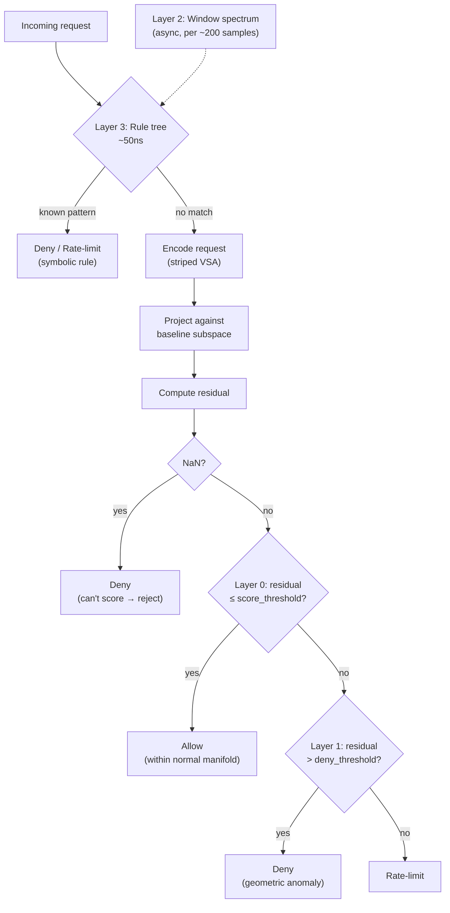

The [previous post](/blog/story/series-004-002-the-expression-tree/) ended with a concept document sitting in `http-lab/docs/CONCEPT-MANIFOLD-FIREWALL.md`. Four layers of geometric defense. The subspace residual IS the enforcement signal. The attacker's burden flips — they must be genuinely normal in 4096-dimensional space.

On Sunday, March 1, I ran 16 experiments in Python to validate the architecture. On Monday, it was running in Rust. By Tuesday evening, a real vulnerability scanner was throwing everything it had at a real vulnerable web application — and finding nothing.

---

## The Last Python Experiment (March 1)

Batch 018 was 16 experiments and 8,152 insertions across 21 files — the largest single batch in the Python repo. It was also the last. Everything after this would be Rust.

The experiments validated the four-layer architecture from the concept doc against the same synthetic traffic scenarios the http-lab had been using. Two new primitives made this possible:

**`OnlineSubspace.subspace_alignment()`** — computes the principal angles between two subspaces from their basis inner-product matrix. Cost O(k × dim). This measures whether two subspaces point in the same *direction* in high-dimensional space, independent of their eigenvalue magnitudes.

**`EngramLibrary.match_alignment()`** — wraps `subspace_alignment()` across the full engram library, producing a library-wide directional matching score.

These complement the existing `match_spectrum()` (eigenvalue cosine similarity, cost O(k)) from the batch 018 challenge doc. `match_spectrum` measures the *shape* of the variance — how much energy is captured in each principal component. `match_alignment` measures the *direction* of the variance — whether the subspaces span the same part of the ambient space.

The pivotal finding was experiment 004:

| Signal | Known Attack Min | Unknown Attack Max | Gap |
|--------|-----------------|-------------------|-----|
| Spectrum only | 0.936 | 0.944 | **−0.008** (wrong direction) |
| Alignment only | 0.338 | 0.276 | +0.062 |
| Combined (spectrum × alignment) | 0.321 | 0.262 | **+0.059** |

<div style="text-align: center; font-style: italic; font-size: 0.9em; color: var(--sl-color-gray-3); margin: 1rem 0">Alignment alone also separates correctly (+0.062) — but combined matches it at 75% less compute. Two engrams evaluated instead of eight.</div>

<div style="max-width: 520px; margin: 1.5rem auto; font-size: 0.9em">

<div style="display: flex; align-items: center; margin-bottom: 1rem; height: 2.8rem">
<span style="width: 10rem; text-align: right; padding-right: 0.8rem; flex-shrink: 0; font-size: 0.85em">Spectrum only</span>
<div style="position: relative; flex: 1; height: 100%; display: flex; align-items: center">
<div style="position: absolute; left: 50%; top: 0; bottom: 0; width: 1px; background: var(--sl-color-gray-4)"></div>
<div style="position: absolute; right: 50%; width: 10%; height: 1.8rem; background: #ff6b6b; border-radius: 3px 0 0 3px"></div>
</div>
<span style="width: 9rem; padding-left: 0.8rem; flex-shrink: 0; color: #ff6b6b; font-weight: bold; font-size: 0.85em">−0.008 — fails</span>
</div>

<div style="display: flex; align-items: center; height: 2.8rem">
<span style="width: 10rem; text-align: right; padding-right: 0.8rem; flex-shrink: 0; font-size: 0.85em">Combined</span>
<div style="position: relative; flex: 1; height: 100%; display: flex; align-items: center">
<div style="position: absolute; left: 50%; top: 0; bottom: 0; width: 1px; background: var(--sl-color-gray-4)"></div>
<div style="position: absolute; left: 50%; width: 74%; height: 1.8rem; background: #51cf66; border-radius: 0 3px 3px 0"></div>
</div>
<span style="width: 9rem; padding-left: 0.8rem; flex-shrink: 0; color: #51cf66; font-weight: bold; font-size: 0.85em">+0.059 — 100% acc</span>
</div>

</div>

Spectrum alone gives a *negative* gap — unknown attacks can score higher than known ones on eigenvalue shape alone. The alignment signal corrects this. Combined, the dual-signal pre-filter achieves 100% accuracy at 75% compute savings over brute-force residual checking (experiment 005: 2 of 8 engrams evaluated instead of all 8, zero misclassifications).

This is the third time the project discovered that magnitude and direction are always complementary — batch 017 found cosine-to-centroid vs. residual, batch 018 found spectrum vs. alignment. **Neither metric alone has been sufficient in any experiment.** ***Combined, neither has failed.***

Other key results from the 16 experiments:

| Experiment | Result |
|-----------|--------|
| 001: Eigenvalue early warning | **22-request lead time** over per-request detection |
| 008: Normal manifold allow list | **0% FPR**, 100% attack rejection, 7.33x residual ratio |
| 013: Allow-list freeze | Unfrozen learning: attack poisoning → total detection loss. Freeze at sample 49 → 0% FPR |
| 014: Cross-layer pipeline | 100% agreement with brute-force at 80.6% compute savings |
| 015: Denial tokens | 100% round-trip fidelity, avg 1.6KB, max 2.1KB |
| 016: Engram promotion (CI/CD) | 100% production coverage from preprod engrams |

Experiment 013 was the one that mattered most for production viability: without freezing the baseline after warmup, an attacker can slowly poison the normal manifold by mixing attack traffic into the learning window. The system loses all detection capability. Freezing at sample 49 (just before warmup completes) eliminates this entirely. This finding informed every subsequent design decision about when and whether to update the baseline. *(Spoiler: [the next post](/blog/story/series-005-002-self-calibrating/) replaces the freeze with something better — boundaries that calibrate themselves from live traffic without ever trusting attack data.)*

---

## Four Layers, 41 Microseconds (March 2)

Monday. The concept doc was two days old. The Python experiments had validated the architecture. Time to build it.

I landed the implementation in a single commit: `17cf513`, 2,457 insertions across 19 files. Four new modules:

**`proxy/src/manifold.rs`** — `ManifoldState`, `evaluate_manifold`, `drilldown_audit`. The manifold state carries the learned normal subspaces (Layer 0), the baseline striped subspace (Layer 1), the current threat mode (Layer 2), and the decision thresholds:

```rust
pub struct ManifoldState {
    pub normal_subspaces: Vec<NormalSubspace>,
    pub baseline: Option<StripedSubspace>,
    pub threat_mode: ThreatMode,
    pub score_threshold: f64,
    pub deny_threshold: f64,
    pub rate_limit_rps: f64,
}
```

`evaluate_manifold` runs inline on every request. The four layers evaluate in order of cost:



Layer 3 is cheapest (~50ns), so known patterns short-circuit first. Layers 0 and 1 are the geometric verdict — the residual IS the enforcement signal. Layer 2 runs asynchronously on sliding windows, classifying threat modes that feed back into the rule tree. NaN residuals default to Deny — a lesson from the Python experiments where NaN handling caused silent failures.

**`proxy/src/denial_token.rs`** — AES-256-GCM sealed context tokens. When a request is denied, the proxy seals the full verdict context into an encrypted token attached to the 403 response:

```rust
pub struct DenialContext {
    pub verdict: String,
    pub residual: f64,
    pub threshold: f64,
    pub deny_threshold: f64,
    pub top_fields: Vec<FieldAttribution>,
    pub src_ip: String,
    pub method: String,
    pub path: String,
    pub query: Option<String>,
    pub user_agent: Option<String>,
    pub header_names: Vec<String>,
    pub cookie_keys: Vec<String>,
    pub concentration: f64,
    pub entropy: f64,
    pub gini: f64,
    pub timestamp_us: u64,
}
```

The token format is `nonce(12) || ciphertext || tag(16)`, URL-safe base64. Avg 1.6KB, max 2.1KB — small enough to fit in a response header. The `holon-engram unseal` CLI decodes them for debugging. This gives complete forensic visibility into why a request was denied without exposing internal state to the attacker.

The mechanism works — sealing, unsealing, round-trip fidelity are solid. What's *encoded* needs iteration. I let the LLM drive the struct fields and didn't push back hard enough on what actually belongs in a forensic token vs. what's noise. The fields above are a first pass, not a final design. Compression would shrink the payload significantly — 1.6KB is fine for a header, but there's no reason it couldn't be a fraction of that with the right encoding. This is on the list.

**`sidecar/src/detectors.rs`** — `WindowTracker` for Layer 2 (window-level spectrum matching). Normal engrams freeze after warmup and thaw when the system needs to update its definition of normal.

**`runner/src/engram_cli.rs`** — engram list/export/import for CI/CD workflows. The preprod→production engram promotion that experiment 016 validated.

The generator also grew — `dvwa_browse` for realistic authenticated browsing, `scanner` for Nikto-style probing, `smuggle` for HTTP request smuggling with duplicate headers. Per-phase instrumentation emits `PHASE_RESULT` lines with latency percentiles, making each scenario self-documenting.

309 tests passing (247 proxy + 62 sidecar).

### The Validation Scenario

`manifold_firewall.json` runs 10 phases over 205 seconds: warmup, normal steady-state, scanner probe, lull, smuggle probe, lull, DDoS flood, lull, mixed scanner, cooldown. 64,678 total requests.

Results:

| Phase | Requests | 2xx% | Deny% | Rate-limit% |
|-------|----------|------|-------|-------------|
| warmup | 2,396 | 100.0 | 0.0 | 0.0 |
| normal-steady | 1,198 | 100.0 | 0.0 | 0.0 |
| scanner-probe | 300 | 3.0 | **97.0** | 0.0 |
| lull-1 | 600 | 100.0 | 0.0 | 0.0 |
| smuggle-probe | 100 | 15.0 | **83.0** | 0.0 |
| lull-2 | 600 | 100.0 | 0.0 | 0.0 |
| ddos-flood | 57,386 | 1.3 | 7.9 | **90.9** |
| lull-3 | 899 | 95.9 | 0.0 | 4.1 |
| scanner-mixed | 450 | 0.0 | **100.0** | 0.0 |
| cooldown | 750 | 100.0 | 0.0 | 0.0 |

Normal false positive rate: **0.0%** across all non-attack phases. Scanner deny rate: 97% on first contact, 100% on second encounter. Post-attack recovery: 95.9% in the first lull after the DDoS flood, 100% by cooldown. These numbers come from the synthetic `manifold_firewall.json` scenario — traffic classes are cleanly labeled and separated by phase, which inflates the apparent accuracy. Real traffic won't have clean boundaries between "normal" and "attack." The DVWA+Nikto test below uses a real scanner against a real app.

Latency:

| Phase | p50 | p95 | p99 |
|-------|-----|-----|-----|
| Normal (dvwa_browse) | 5.4ms | 9.0ms | 11.3ms |
| Scanner (denied) | 3.2ms | 9.2ms | 11.3ms |
| DDoS (rate-limited) | **41µs** | 3.0ms | 6.4ms |
| Cooldown (normal) | 5.8ms | 9.5ms | 11.6ms |

The **41 microsecond p50** during the DDoS phase is the full short-circuit latency for requests that never reach the backend: HTTP parse, Layer 3 rule tree lookup, spectral encode (bind + bundle per stripe), project against each stripe's subspace, compute RSS residual, compare against threshold, emit 429/403 response. Most DDoS requests hit the rate-limiter (429); the rest are denied by geometric scoring (403). Either way, they don't proxy. The 5.4ms normal latency is dominated by the upstream backend round-trip — the spectral scoring is invisible in the allowed path.

The geometric separation between normal and anomalous traffic was roughly 2x the threshold — normal residuals clustered around 15–29 against a threshold of ~27, scanner residuals at 53–60. Well-separated distributions.

<div style="display: flex; flex-direction: column; align-items: center; text-align: center">

<video controls autoplay loop muted playsinline style="max-width: 100%">
  <source src="/demo-spectral-detection.mp4" type="video/mp4" />
</video>

*The spectral firewall learns what "normal" looks like during a 15-second warmup, then scores every request by its geometric distance from that baseline. Scanner probes are denied outright — they're unknown to the manifold, so the residual spikes and the verdict is immediate. The DDoS flood is fully rate-limited. No signatures, no pre-loaded rules. The deny decision is geometric — the residual IS the enforcement signal. (The dashboard UI shown here includes improvements from the [next post](/blog/story/series-005-002-self-calibrating/) — the videos were recorded after that work was done.)*

</div>

---

## DVWA + Nikto: Real Scanner, Real App (March 3)

Synthetic traffic validation proves the architecture. Real scanner validation proves the system.

DVWA (Damn Vulnerable Web Application) is a deliberately vulnerable PHP app with known SQL injection, XSS, command injection, and file inclusion vulnerabilities. Nikto is a web server scanner that probes for thousands of known vulnerabilities, dangerous files, outdated software, and misconfigurations. It's the kind of tool that a penetration tester runs to inventory everything wrong with a web server.

The setup:

```
Nikto (Docker) → https://localhost:8443 → Spectral Firewall → http://localhost:8888 → DVWA (Docker)
```

Warmup was 30 seconds of authenticated DVWA browsing via the generator with `--cookie` support (real PHPSESSID + security cookies). This produced a 94.4% 2xx rate during warmup — the baseline was genuinely representative of normal DVWA usage, not synthetic browse patterns.

Then Nikto ran.

10,121 requests denied. 0 exploitable vulnerabilities found through the proxy.

Without the firewall, hitting DVWA directly, Nikto finds **17 vulnerabilities**: PHP backdoors, directory traversal, remote command execution, D-Link router injection, exposed admin pages, missing security headers.

Through the spectral firewall: zero.

An unsealed denial token shows why:

```
verdict:         deny
residual:        53.19  (threshold: 25.46, deny: 50.92)
deviation:       2.1x above normal

request:
  GET /
  src:        127.0.0.1
  user-agent: Mozilla/5.0 (Windows NT 10.0; ...) Chrome/74.0.3729.169
  headers:    [connection, user-agent, host]
  cookies:    (none)

anomalous dimensions:
  path                 48.72
  query_shape          48.07
  path_parts           47.90
  headers              47.52
  query_parts          47.52
```

Nikto pretends to be Chrome but sends only 3 headers (a real browser sends 7–8), no cookies (normal authenticated DVWA sessions have PHPSESSID + security cookies), and wrong header ordering. The spectral firewall doesn't know what Nikto is. It doesn't have a Nikto signature. It knows what normal DVWA traffic looks like — and Nikto's traffic doesn't look like it, across multiple dimensions simultaneously.

But look at those attribution scores again: 48.72, 48.07, 47.90, 47.52, 47.52. A 1.2-point spread across a 47–49 range. The verdict was correct — this request *is* anomalous — but the explanation is garbage. Which field actually drove the anomaly? All of them, apparently, at nearly identical scores. `src_ip` (not shown, but present in the full drilldown) scored 47.5 — and `src_ip` is the same for *all* traffic in this test. The detection was right. The attribution was telling me everything was equally suspicious, which is the same as telling me nothing. I noted it and moved on — the deny/allow decision didn't depend on attribution quality, and there were bigger fires to fight. But it would need fixing: the sidecar generates rules from these attributions, and operators need denial tokens that explain *what* was wrong, not just *that* something was wrong.

The system generated 17 auto-detection rules during the scan — compound constraints spanning TLS fingerprint, header structure, and path patterns. These rules are a secondary defense (Layer 3); the primary defense was geometric denial (Layers 0+1). The anomaly streak reached 236 consecutive windows — sustained, consistent anomaly, exactly the kind of signal the system was designed to detect.

### Bug Fixes from Live Validation

Two bugs surfaced during the DVWA runs that I hadn't caught in the synthetic scenarios:

**WindowTracker first-contact**: the spectrum classification path crashed on an empty engram library. In synthetic scenarios, the library was always populated by the time spectrum matching was attempted. Against Nikto, the scan started before the first window completed. Fix: handle the empty-library case gracefully, defaulting to the residual-based verdict.

**NaN handling**: when the striped subspace hadn't converged (too few samples in a stripe), residual computation returned NaN. The original code treated NaN as RateLimit — lenient. Fix: NaN → Deny. If the system can't compute a residual, the request doesn't pass. This is the conservative default.

The denial key was also not being persisted — randomly generated on each restart, making previously sealed tokens unreadable. Fix: persist to disk, load on boot.

<div style="display: flex; flex-direction: column; align-items: center; text-align: center">

<video controls autoplay loop muted playsinline style="max-width: 100%">
  <source src="/demo-nikto-spectral.mp4" type="video/mp4" />
</video>

*Nikto vulnerability scanner targeting a live DVWA instance through the spectral firewall. Each card in the deny log is a blocked request — the color runs from grey (low residual, near the boundary) to red (high residual, deep anomaly). Nikto lights up solid red. Over 10,000 scanner requests denied by geometric anomaly detection. The proxy learned its baseline from 30 seconds of normal browsing traffic — no signatures, no vulnerability database. Nikto finds 17 exploitable vulnerabilities when hitting DVWA directly; through the spectral firewall, it finds zero.*

</div>

---

## Why "Spectral Firewall"

The concept doc called it the "manifold firewall." The March 3 commit renamed it across all docs, comments, and UI text — code identifiers stayed the same.

"Spectral" is more precise — and it sounds cooler. Both reasons mattered. The detection mechanism is eigenvalue spectrum analysis: CCIPCA computes principal components, the eigenvalues describe the variance structure of the learned subspace, and the residual measures how much of the input falls outside that learned spectrum. `match_spectrum` uses eigenvalue cosine similarity. The drilldown attribution decomposes the anomalous component against the spectral basis. "Manifold" describes the geometry of the data — valid, but generic. "Spectral" describes the mechanism. It also sounds like something that would glow in a Doctor Strange scene, and I'm not above that being a factor.

---

## Where March 3 Left Off

The spectral firewall worked. Against synthetic scenarios and against a real vulnerability scanner, it detected and denied anomalous traffic with zero false positives. The core claim — geometric anomaly detection with no signatures, no training data, no GPU — was validated.

Three problems remained:

**Monolithic encoding.** The attribution problem from the Nikto drilldown above. Every fact about a request — method, path, each header name and value, each TLS cipher, each cookie — gets encoded as a "binding" in the vector (a role-value pair, like `method⊗GET`). A typical request produces ~100 of these bindings, all superimposed into one 4096-dimensional vector. That's pushing against the Kanerva capacity ceiling (~123 items at D=4096), and at that density, bindings interfere with each other. Detection works; attribution is noise. The sidecar is generating rules from garbage scores — it works by accident, not by design.

**Magic numbers.** `sigma_mult=3.5`, `deny_mult=2.0`, `ADAPTIVE_RESIDUAL_GATE=0.7` — three hardcoded constants controlling the decision boundaries. These were tuned by hand against the synthetic scenarios and happened to work for Nikto. Different traffic distributions would require different values. A production system can't ship with constants calibrated to one lab's traffic patterns.

**Single scanner diversity.** Nikto is one tool. Production traffic includes browsers, mobile apps, API clients, bots, scrapers, and multiple scanner types running concurrently. The spectral firewall hadn't been tested against diverse legitimate traffic mixed with diverse attack traffic simultaneously.

The next post addresses all three.

---

## Likely Contributions to the Field

- **Four-layer geometric WAF architecture with sub-100µs deny latency**: combining symbolic rules (Layer 3, ~50ns), manifold membership scoring (Layer 0), residual-as-enforcement (Layer 1), and async window spectrum matching (Layer 2) — each layer handles a different threat class at a different cost, all without signatures or training data
- **AES-256-GCM sealed denial tokens**: sealing verdict context into an encrypted token attached to the deny response — the mechanism works, the encoding needs refinement (see caveat above)
- **Dual-signal spectral pre-filter validated at 100% accuracy / 75% compute savings**: combining eigenvalue spectrum (magnitude) with principal angle alignment (direction) for engram library matching, eliminating the failure mode where either signal alone produces false classifications
