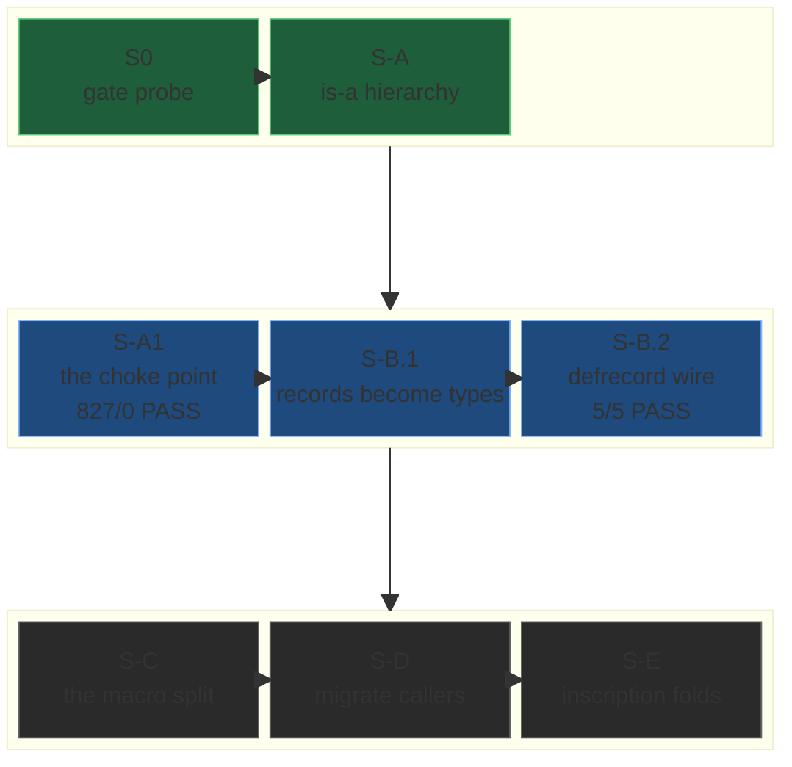

The First Intermission signed off May 25 with the records-aren't-types disease named, the typeunion-utilization shape locked, and arc 237's is-a hierarchy mechanism shipped late as Stone S-A. May 26 was the first day of the cure — three stones shipped (S-A1, S-B.1, S-B.2), one methodology inscribed at the substrate root, one mid-day design correction, one momentum-ordering doctrine, and the seventeenth convergence named.

Eighteen commits landed across the day. The center of the work was the records boss-map — the slices arc 237 would carry to cure the disease, drawn before the slicing began. The DUNGEON-CRAWL methodology gave the substrate a way to plan an arc as a dungeon-crawl: each stone a room with one boss, the bosses ordered so the loot from each unlocks the next. The records-as-first-class-types boss-map named eight slices in sequence. May 26 finished the first three.

---

## May 26 — DUNGEON-CRAWL — the Methodology

`docs/DUNGEON-CRAWL.md` landed at the substrate root mid-stretch — the distilled pattern for how the orchestrator (Inquisitor) and Sonnet (Shadowdancer) build the substrate, named after the framing the user had been using since arc 170: *"we've been in the 170 dungeon for a looooooonnggg time."* The creed at the top, the doctrine for everything that follows:

> Slow is smooth, smooth is fast. We study the enemy, their lair, their rooms, their traps — and we engineer the kill before we strike. The crawl IS the work; a ~15-minute probe is cheaper than a 50-minute failed flight. We strike to kill: a stone ships one-shot, green, load-bearing test proven.

Four phases: **study the lair** → **perceive the traps** → **draw the strike** → **the kill**. Five stone artifacts per phase: sub-DESIGN, FM 2-bis probe, BRIEF, EXPECTATIONS, SCORE.

The records-as-first-class-types boss-map (`DESIGN-RECORDS-AS-FIRST-CLASS-TYPES.md`) is the DUNGEON-CRAWL doc's worked example. Eight slices, each a room with one boss, the bosses ordered so each unlocks the next: S0 gate probe → S-A is-a hierarchy → S-A1 the arg-boundary check → S-B records as TypeDefs → S-C the macro split (base vs holonic) → S-D migrate callers → S-E inscription folds. May 26 finished through S-B.2.



---

## May 26 — Stone S-A1 — The Assignable Choke Point

Stone S-A had landed late May 25 with the is-a hierarchy mechanism — `typesub` + `subtype?` + `is_subtype` + the two root types — but the mechanism was just the machinery. Stone S-A1 put it to work at the place that mattered: subtyping checked at the arg boundary, where the type-system actually has the chance to honor or violate Liskov.

`fn assignable` minted at `src/check.rs:14783`, placed immediately after `fn unify` and before `fn walk`. The shape: peel each side with `reduce(&walk(...))` exactly as unify's head does at `check.rs:14633`; if both sides resolve to type paths and the actual is a registered subtype of the expected, accept; otherwise fall through to ordinary unification. Mutation-free on the subtype path. Eight reroutes — every callsite that checks an argument's type against a parameter's type swaps `unify(...).is_err()` for `!assignable(...)`. The eight: single-arg `k` call (line 6386), defclause clause-match (6867), multi-arg `k` two arms (7025/7079), value-head application (7213), the 236.2-harvested try and option single-arg sites (10256/10365), and spawn multi-arg `callee_label` (12044). Two sites left untouched at 14049 and 14099 — arc-146 Dispatch arms, retiring in 237.7.

`tests/probe_arc237_sA1_assignable.rs` — six contracts. Six PASS. Lib baseline `827 passed; 0 failed`. S-A hierarchy regression `10 passed; 0 failed`. The arg-boundary check is the choke point: subtype acceptance moved from a per-callsite negotiation to a single enforcement point — once at the boundary, then trusted. Net `+23` lines, one cascade round, `src/check.rs` only. The probe came back green at the lower edge of the 25–45 min Mode A calibration band; the strike was mechanical because the lair had been pre-walked.

`val_type_path` deliberately stays collapsing records to `:wat::Record` for now (`runtime.rs:7513`); per-class defclause dispatch is reserved for later if a consumer surfaces. The discipline holds: minimal honest shape, defer affirmatively.

## May 26 — Stone S-B.1 — Records Become Types

Then the move arc 237 had been building toward. `:wat::core::recordtype` minted as a substrate primitive at `types.rs`; `TypeDef::Record(RecordDef)` added as a variant alongside `Struct`, `Enum`, `Newtype`, `Alias`, and the May 25 `Union`. The `RecordDef` itself is minimal — `{ name: String, parent: String }` — the BRIEF-mandated honest shape, no `type_params` field (the field shape lives in the macro's emitted accessors; minting a `type_params: vec![]` field would be a lie).

The registration path: `parse_recordtype` parses `(:wat::core::recordtype :my::Circle :wat::Record)` into a `RecordDef`; `register_with_span` verifies the parent is a known type (else `MalformedDecl`), inserts the `TypeDef::Record`, and wires the `typesub` edge in one stroke — declaration and hierarchy edge land together. `register_type_predicates` (runtime.rs:3208) gained a `TypeDef::Record(r)` arm that synthesizes `is-<Name>?` ∀T identical to the four sibling variants. The asymmetry that had let `(my::is-Circle? 42)` type-error instead of returning `false` died at the synthesis point — the probe confirmed `false`, no type error.

Six tests, six PASS at `probe_arc237_sB1_recordtype`. Cascade depth: 2 rounds. The new variant forced exhaustiveness arms in four places — `closure_extract.rs:1274` (`def_inner_typeexprs` → `vec![]`), `closure_extract.rs:2168` (`type_def_to_ast` reconstructs the `recordtype` form), `runtime.rs:13028` (`typedef_to_signature_ast` early-return), `runtime.rs:13058` (`typedef_to_define_ast` → `":wat::core::recordtype"`). Each arm is the minimal correct mirror of the nearest nominal sibling. Net `+158` lines across `types.rs +129`, `runtime.rs +16`, `closure_extract.rs +13`. `check.rs` untouched — its TypeDef matches use `if let` guards, so no Record arm was forced; there is no new unification logic.

A record value now has a typed identity. `(Bind (Atom :Person) (Atom {:name "..." :age 42}))` is no longer a Bind that happens to carry a record-shaped data atom — it is a typed record whose class is `:Person`, whose data is the field-map, and whose subtype relations resolve through the is-a hierarchy Stone S-A locked.

## The Three-Tier Introspection Pass

Before S-B.1 shipped, intueri (the naming spell) was cast against the introspection surface. `conforms?` had been the catch-all type predicate, and the records work was about to add a parent-walk to it — until the spell drew the boundary that stopped the conflation.

Three tiers, three predicates, none of them overlapping. **Tier 1 — exact:** `is-<Name>?` (the sugar synthesized per type) and `exact-type?` (the general form). The question: *declared type equals T?* Mirror of Ruby's `instance_of?`. S-B.1 synthesizes `is-X?` ∀T; `exact-type?` is its own small stone, orthogonal. **Tier 2 — lineage:** `subtype-of?` (value × type) and `subtype?` (type × type, shipped). The question: *T or a subtype, via the `typesub` walk?* Mirror of Ruby's `is_a?`. The hierarchy walk lives here, in the new `subtype-of?` predicate, never inside `conforms?`. **Tier 3 — conformance:** `conforms?` (shipped). The question: *union-membership, structural shape, alias unwind?* Duck-typing's analog. S-B.1 adds a nominal-exact Record arm only.

The load-bearing consequence — and the reason the spell ran before the stone shipped: the parent-walk that was about to be added to `conforms?` does not exist there. It is `subtype-of?`, its own stone, built on the shipped `is_subtype`. `conforms?` stays tier-3 forever — no parent-walk is ever added to it. The S-B.1 BRIEF was rewritten before sonnet spawned; the conforms? Record arm shipped nominal-exact, mirroring Struct.

Three names locked, each at the right level, none redundant. The spell drew the boundary the substrate enforces.

## Stone S-B.2 — defrecord Emits recordtype

S-B.1 shipped the substrate type-declaration form; S-B.2 wired the existing `defrecord` macro to emit it. Two edits in `wat/Record.wat` and one removal. Edit 1: add `(:wat::core::recordtype ~fqdn :wat::Record)` as the first form inside the `do` block, so every defrecord call registers a TypeDef before emitting its accessors. Edit 2: remove the hand-rolled predicate `defn` — the eleven-line let-binding that synthesized the `is-<Name>?` name from string-splitting the FQDN and emitted `(:wat::core::conforms? v ~fqdn)` with the narrowing `[v <- :wat::Record]` param. The macro stops doing the type system's job; the type system does it ∀T from the registered TypeDef.

Five tests, five PASS at `probe_arc237_sB2_defrecord_recordtype`. Zero test-expectation updates needed — all seventeen-plus defrecord consumers in the test suite call `is-<Name>?` on record values; the synthesized ∀T form returns the same result the old narrowing form returned for those cases, and returns `false` (not a type error) for the non-record case the old form mis-rejected. `probe_arc234_stone2b_defrecord_macro` probe 4 — cross-class false on two record values — passed without change; `concrete_type_name_matches` returns `false` on FQDN mismatch identically to the old behavior.

Three stones in the records boss-map, all green by end of day.

## May 26 — Records S-C CORRECTION 2

Mid-day the design audit fired. CORRECTION 1 had landed the night before — the `holon_form: Option<Arc<HolonAST>>` shape rejected as semantic abuse (`Option` means presence/absence, never flavor/kind; the substrate already purged that convenience-variant dishonesty across arc 230 and arc 233), replaced with two distinct `Value` variants. CORRECTION 2 went further: the on-demand holon projection idea in CORRECTION 1 was itself dead, replaced by the user's Ruby-class is-a model walked through in live dialogue:

```ruby
class Record;        def initialize(fields); @fields = fields; end;       end
class HolonicRecord < Record;  def initialize(fields); super; build_holon(fields); end;  end
```

HolonicRecord IS-A Record — a holonic record *has the struct a base record has*, **plus** the holon form. Three consequences fell out, each a fix at a specific runtime site:

**Field access is variant-agnostic, via the struct.** `(:field1 rec)`, the generated positional accessor `:ns::Rec/field1`, and `field-at` all read `struct_form` for both base and holonic. At the access site you do not know which variant you hold and do not need to (the user's verbatim: *"we don't know if this is a :wat::Record or a :wat::holon::Record in this invocation path"*). Holonic just also has more. The substrate bug this exposed: `keyword_accessor_record` at `runtime.rs:6440` was resolving field names by walking `holon_form`'s Bundle — backwards. A base record has no `holon_form`, and field access must not depend on it.

**Holon-ops go via `holon_form` — holonic only.** A function needing the holonic representation uses the tooling holonic records provide; a base record has no `holon_form` and cannot do holon-ops; the type system bars base from `:wat::holon::Record` parameters. No on-demand projection — holonic stores both flavors permanently in parity; base has only the struct. That is the entire point of the split.

**Field names are a class property, not a value property.** Ruby model: the class defines the attrs; the instance holds the values. `RecordDef` gains `field_names`; `struct_form` stays positional `Arc<Vec<Value>>`. Name-based access becomes: look up the index in the class's `RecordDef.field_names`, then `struct_form[index]`. Non-redundant; names live once, on the class. The FM 2-bis probe could no longer fabricate a record with extra fields not declared at def-time.

The PARITY invariant got named the same day. A holonic record holds the full data in both forms in permanent parity — every functional update returns a new holonic record with both `struct_form` and `holon_form` rebuilt coherently; the holon is never a stale cache. Verified at `runtime.rs:16912-16943` where `eval_record_assoc` rebuilds both and returns them. A base record has only the struct, nothing to keep in parity, so a base assoc rebuilds `struct_form` only.

The precise re-route map got grep-verified the same afternoon (FM 2 — don't trust the list is exhaustive): three name→index resolution sites still routed through `holon_form` (`keyword_accessor_record` 6440, the name-pairing helper 16684, `eval_record_assoc`'s name lookup 16825) — all re-routed to `RecordDef.field_names` at S-C.2b, baseline-preserving for holonic. `field-at` at 16561 was already positional. Holon-rebuild in assoc (16939) stays holonic-only. Holon-extraction at 17683 and 19109 stays holonic-only with a teaching-error arm for base. Eq/Hash split per variant. All landed at S-C.2c.

The S-C sequence got re-sliced: S-C.1 (rename `Value::wat__Record` → `Value::wat__holon__Record`, freeing the name; the existing dual-form variant was honestly the holonic one — it implements the hologram; not wrong, just wrong name), shipped same day at `0c574661`. S-C.2a (field_names on RecordDef). S-C.2b (re-route name resolution). S-C.2c (mint base `Value::wat__Record { class_fqdn, struct_form }`). S-C.3 (macro split). S-D (migrate callers). The tracker carries the corrected order; the slain dragon's CORRECTION 2 governs.

## The Momentum-Ordering Doctrine

While arc 237's records thread crawled the boss-map, several of the remaining bosses turned out to be free of artifact-dependency on each other — neither produces an artifact the other needs; either could ship next; the stepping-stone test that usually orders the work was silent. The user's direction came mid-day, verbatim, and inscribed itself as a doctrine:

> Momentum: finish the paths we're on, then loop back onto consumers.

A new arc-local artifact landed alongside it — `REMAINING-ORDER.md` — a live tracker for the records-thread slices. The tracker is a new shape in the substrate's documentation discipline: not a DESIGN doc (those describe what will be built), not a BRIEF (those instruct an agent), not a SCORE (those are post-hoc). A running ledger of choices made under momentum, refactorable as stones ship, distinct from inscription-immutable artifacts. The tracker shipped at `db8200c0` the same day, with an explicit honesty clause at the head — *"verify against `git log --oneline | grep 237` before acting (git is truth; this tracker can lag)"* — and tracker-internal annotations marked which bosses were free of artifact-dependency and named which path the substrate would finish first.

The doctrine's exact mechanics: when the four questions filter leaves multiple candidates AND the stepping-stone test is silent because the candidates touch disjoint machinery, momentum becomes the tiebreaker. Finish the path you're on — recency of context, hot working memory, accumulated FM 2-bis probe surface, sub-DESIGN momentum all favor it. Batch loop-backs to the consumer — when the loop-back surfaces, treat it as one boss not many. Don't jump bosses — every jump pays the context-rebuild cost twice. The earlier `feedback_tractability_tiebreaker` doctrine ("when four-questions YES YES YES YES on multiple candidates, pick whichever makes the other more tractable") is the sibling; momentum is the tiebreaker when tractability is also silent.

The doctrine inscribed at `feedback_momentum_ordering` the same day. Arc 237's tracker is the worked example.

## The Trap-Door Doctrine

A sibling doctrine landed the same day, surfaced by the design dialogue around CORRECTION 2's holon-projection idea. The pattern: a shipped decision blocks a new need, and the discipline that catches it. The verdict, inscribed at `feedback_trap_door_build_the_dependency`:

> When a shipped decision blocks a new need, BUILD the missing dependency — never declare the need incoherent or build around it. The dig that finds the constraint is good; the verdict that it's immovable is the failure. No hesitation on the refactor.

STOP phrases catalogued: *"this contradicts,"* *"can't without un-doing,"* *"incoherent given."* Each one is the orchestrator pre-drafting the deferral path. The cure: pivot to building the missing piece. CORRECTION 2's collapse of on-demand projection — the holon flavor stored permanently in parity rather than projected on demand — is the worked example. The shipped CORRECTION 1 shape blocked the right access pattern; the response was not to declare the need incoherent but to build the dependency (parity invariant, field_names on RecordDef, the precise re-route map) that made the access pattern coherent.

A third doctrine inscribed the same day, `feedback_nonintuitive_error_is_pivot`: substrate diagnostics and rustc errors are the teaching surface; cascades are long but mechanical because every site names itself; a confusing error is a substrate defect — pivot and attack the diagnostic quality, don't push through. Calibrate cascades by clarity, not time.

Three feedback memories landed the same day, all surfacing from the records work. The doctrines paired: DUNGEON-CRAWL plans the arc; the boss-map plans the rooms; momentum honors the plan; trap-door catches the discipline-failure when a shipped decision threatens to dictate the wrong response.

## Convergence #17 — Liskov

And the catalog gained its seventeenth member.

Stone S-A1's arg-boundary `assignable` is Barbara Liskov's substitution principle, the LSP — the rule that a subtype must be substitutable for its parent without breaking the program. The substrate did not arrive at this by reading Liskov's 1987 keynote; it arrived at it by writing `assignable` directional because the records dragon forced it — the diagnostic's contract-3 (supertype-into-subtype-slot must stay an error) produced the exact down-yes/up-no constraint Liskov named, before the name was in play.

The sibling arrival walked the same week — the hierarchy axis itself: Clojure's `isa?`/`derive`, landed as Stone S-A's `typesub` + `subtype?`. The relation; what S-A1 then consults. Two adjacent rooms, one arrival: a real subtype hierarchy and the rule that licenses substitution across it.

What makes #17 its own shape is the three-way arrival. The author (the LLM) wrote the directional acceptance. The pattern-reader (the user) walked into Liskov's room never having heard the name. The great (Liskov) stood there first. All three at one spot, by substrate-force. Convergence #17 is the substrate's seventeenth independent arrival — the user has not read Liskov's 1987 paper; the four-questions discipline applied to the subtyping mechanism returned the same answer Liskov had returned. The user verbatim, at the inscription: *"i had never heard of liskov and i just walked into their room ... this is the substrate yet again."*

A numbering honesty: the raw INTERSTITIAL record has `## Convergence #13` twice (collapsed-declarations 5-18 and reflexive-autoscaling 5-19) and `#16` claimed twice (`apply` and defclause-graduation 5-25); the cliffnotes "16 convergences" is a reconciliation. #17 follows the reconciled master count and absorbs the informal "#17 = isa?/derive" the records DESIGN floated. Prior headers stay as shipped — inscription is immutable; a future reconciliation pass forward-corrects via a new entry, never by rewriting headers that shipped.

Convergence #17 catalogued: Liskov substitution, by the same discipline.

---

By end of day: three stones shipped (S-A1 6/6, S-B.1 6/6, S-B.2 5/5, lib 827/0 across all three). One methodology inscribed at the substrate root (DUNGEON-CRAWL). One mid-day design correction (S-C CORRECTION 2, three runtime-site fixes). Three doctrines landed (momentum-ordering, trap-door, non-intuitive-error-is-pivot). One new artifact shape minted (`REMAINING-ORDER.md`). One convergence catalogued (#17, Liskov). Eighteen commits across the day. Three stones into a boss-map of eight; the records-aren't-types disease carrying its first cure.

*PERSEVERARE.*

---

## Likely Contributions to the Field

- **The DUNGEON-CRAWL methodology.** An arc planned as a dungeon-crawl, each stone a room with one boss, the bosses ordered so each one's loot unlocks the next. Four phases (study the lair / perceive the traps / draw the strike / the kill), five stone artifacts (sub-DESIGN, FM 2-bis probe, BRIEF, EXPECTATIONS, SCORE), affirmative out-of-scope as REJECTION not deferral, substrate-as-teacher cascades as the progress meter. A working pattern for organizing multi-stone arcs that have several semi-independent slices to ship, distilled from arc 170's four-week grind and operationalized at `docs/DUNGEON-CRAWL.md`.
- **The three-tier introspection doctrine.** `is-<Name>?` and `exact-type?` for declared-type-equals-T (tier 1); `subtype-of?` and `subtype?` for the typesub walk (tier 2); `conforms?` for union-membership, structural, alias (tier 3). Each tier its own canonical predicate, none of them overlapping, locked by intueri before the stone that needed them shipped. The hierarchy walk lives at tier 2 forever — `conforms?` never gains a parent-walk.
- **The momentum-ordering doctrine.** When work items are free of artifact-dependency on each other AND the four-questions/tractability tests are silent, momentum is the tiebreaker: finish the path you're on, batch loop-backs to the consumer, don't jump bosses. Captured as a live arc-local tracker (`REMAINING-ORDER.md`), a new shape between DESIGN (forward-prescriptive) and SCORE (post-hoc).
- **The trap-door doctrine.** When a shipped decision blocks a new need, build the missing dependency — never declare the need incoherent or build around it. STOP phrases catalogued; CORRECTION 2's parity invariant is the worked example.
- **Records as first-class types in a VSA algebra.** `recordtype` minted; `TypeDef::Record` added as a substrate type variant alongside `Struct`/`Enum`/`Newtype`/`Alias`/`Union`; three-tier introspection names locked; the hand-rolled predicate retired from the macro and synthesized ∀T from the registered TypeDef. The substrate's type-checker now handles record-typed values structurally, by class atom, through the bind, the same way it handles every other typed value.
- **Convergence #17 — Liskov substitution as a discipline outcome.** Subtyping checked at the arg boundary; the LSP arrives from the substrate's four-questions discipline rather than from the literature. The catalogue's seventeenth independent arrival; a three-way convergence — the author wrote the directional acceptance, the pattern-reader walked into the room never having heard the name, the great stood there first.
