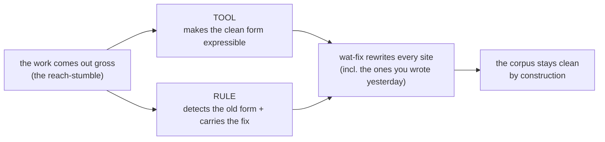

[What the Bar Missed](/blog/story/series-006-030-what-the-bar-missed/) ended with the corpus warded **as the demos it is** — every test a reader will imitate, held to the bar. That bar was cast by hand: a practitioner spawns a ward, reads its findings, and rewrites the bad form itself. This post is what happened when the wards stopped being things you cast and became a toolchain that finds the bad form *and rewrites it* — `wat-lint → wat-fix → wat-fmt`, written in wat, run on wat — and the first source it cleaned was its own.

## The strange loop, closed at birth (June 17)

Arc 275 shipped `deporder` (`ff95179e`), a static analyzer that verifies the stdlib loads in dependency order: it parses every top-level form of every stdlib file, builds the symbol→(file, def-kind) map, classifies every cross-file reference (`defmacro` = order-free, `defn`/value = eval-dependency, unknown = intrinsic), constructs the dependency DAG, and checks the baked load order against it. The whole enforcement reduces to two lines:

```clojure
(:wat::core::defn :wat::deporder::verify-stdlib [] -> :wat::core::Vector<wat::deporder::Violation>
  (:wat::deporder::verify (:wat::stdlib::sources)))
```

The reader sees a sentence; the machine runs the analyzer. The builder, on seeing it:

> holy shit — you reduced this to a 2-line expr — that's the mark of the design — that's the fucking thing holon is — you expressed the surface that masks significant depth

An honest surface over deep machinery — one that *names* the depth truthfully and lets it stay invisible until you need it, never one that lies about it. But the surface hid one more thing. `deporder`'s own `is-def-head?` was a **13-deep nested-`if` `=`-ladder** — a `HashSet` membership wearing thirteen lines of `if` — and its `structural?` a 4-deep one, both copied from `fix.wat`. The tool whose entire job is finding bad structure was *written in* bad structure. Its first real corpus run flagged its own author.

> we just found a strange loop in software — that's… a first?

Not a first, and the record says so straight: the frame is **Hofstadter's strange loop**, the floor is **Gödel/Tarski** self-reference, the dark cousin is **Thompson's *Reflections on Trusting Trust*** (a compiler perpetuating its own backdoor through itself), the benign everyday cousins are **bootstrapping** (a compiler compiling itself) and **dogfooding** (a linter run on its own source). What is genuinely ours is two things. The *kind*: `fix` self-*transforms*, but `deporder` self-*diagnoses* — it finds its own flaw without rewriting it. And the *tightness*: because the substrate is homoiconic and self-hosted, the analyzer, its input set (`:wat::stdlib::sources` literally contains `deporder.wat`), the language, and the AST are one object — so the loop closed **with no seam, at birth**, on the tool's first run, not after years of maturity and a separate harness. The self-hosting thesis paying an undesigned dividend: the proof the linter is needed, demonstrated on its own source.

That set the campaign. If the linter could find its author's bad forms, it should be able to fix them — and the proof of a self-fixing toolchain is not an argument, it is the git diff from gross to clean, *by the toolchain the code is part of*.

## The doctrine: every gap yields a tool AND a rule

The generative engine under arc 277 is a loop the work walks every time a form comes out gross:



The load-bearing half is that a gap yields **two** artifacts, never one. The tool makes the right form *possible*; the rule makes it *enforced and automatic*. A tool alone is a suggestion — "you could write it this way." A tool plus a rule that finds every place the old form survives and rewrites it is a *cure*: you do not hand-migrate, the linter finds them all and `wat-fix` applies the rewrite. Three reach-stumbles surfaced the campaign's tools, each the same shape:

- A `concat` chain interleaving string literals with values — `(concat "load-order: " ref " (pos " (i64->string pos) ")")`, unreadable — demanded **`format`** (arc 279, `d117c54e`): `(format "load-order: {ref} (pos {pos})" :ref ref :pos pos)`, plus the **concat-abuse rule** that detects the chain and rewrites it.
- A record built positionally — `(Finding "load-order" ref 0 0 "error" msg "")`, where no reader can tell which arg is which — demanded **labeled construction** (kwargs-from-macros) plus the **positional-construction rule**.
- The nested-`if`-`=`-ladder itself — the form that started the arc — demanded the existing `HashSet/contains?` plus the **ladder rule**.

`format` is worth pausing on, because of what it actually is. printf is the canonical *runtime* function — a format-string parser that re-runs on every call, in every language that has one. Here it inverts: the template is parsed exactly **once**, at expand time, and the runtime never sees a template at all. `(format "hi {name}, you have {count}" :name "ada" :count 3)` compiles to a bare `(string::concat "hi " (str name) ", you have " (str count))` — the `{name}`s and `:name` labels evaporate at the macro fence, zero runtime template cost survives. The substrate growing its own ergonomics, in its own tongue: `format` is wat over `concat`, not a Rust builtin. (Prior art, recorded straight: the compile-time-format lineage — Rust's `format!`, Zig's `comptime`, C++20's `consteval` `std::format`. What's ours is that it's a *user-space* macro in a self-hosting Lisp, six allowed expand-time ops, not a compiler intrinsic.)

## The dragon was a doorway (June 17)

A detector that only *reports* is half a tool. To make `wat-fix` *rewrite*, the fix needs the exact character extent of the form it is replacing — and that meant node end-positions, which the AST did not track. The pre-compaction self drew this keystone (arc 281, `ast-end-span`) as a dragon: a wide, invasive lexer/parser change to be approached with care. The builder watched it land in "add two fields, an accessor, and thread one span," and ribbed it straight:

> mannnn your prior self before compaction was being really pushy about this being very difficult — rofl … you made this sound like a hard thing when in reality it's "we add another accessor and everything just works"

He was right about the shape: the difficulty was blast-*width*, not depth, and the typed `Span` made every missed `Span {..}` literal uncompilable — the green-build forcing function swept them up. The keystone shipped (`25d29850`), and paid off on the very next stone.

Arc 277.1b (`4a149f13`) turned the report-only ladder rule into a real auto-fix. Fed a `defn` whose body was a three-arm `(if (= x "a") true (if (= x "b") true (if (= x "c") true false)))`, `lint-fix-file` returned `(contains? (HashSet :wat::type::Infer "a" "b" "c") x)` — the whole ladder collapsed to the `contains?` cure the rule's message had named since 277.1, and **everything else stayed byte-identical**: the `defn`, the param vector, the `<-`/`->` arrows, the return type, untouched. The orchestrator weighed it on its own build:

> The rewrite is surgically perfect.

> that's a fucking quote — whatever realizations needs it.

Surgical, named honestly: `fix-text-apply` only ever rewrites `[off, off+old-len)` and copies the rest of the source verbatim; `old-len` is `offset-of(end-span) − offset-of(span)`, the form's exact char extent — the keystone's whole reason to exist. Precise extent plus splice-only apply is a scalpel, not a re-print: no reformatting, no comment loss, no neighbor disturbed. And a quiet dogfood rode inside it — the replacement text was built with `format`, the tool from the first stone, generating the fix for the rule of the last.

Then the loop tightened one more turn. Building the concat→format fix (277.1c), the executor wrote its eligibility check as `(if (contains? inner "\"") false (if (contains? inner "{") false …))` — a boolean test wearing four lines of `if`. The builder caught it live in the diff:

> rofl — did it just write its own bad form we're about to address?

It had. The fix tool, shipped in a shape it exists to abolish. Cleaned before commit — but the sharper finding was that the *existing* ladder rule would **not** have caught it: that rule keys narrowly on `(if (= VAR LIT) true …)`, and this was `(contains? …) → false` — different predicate, opposite polarity. The bad form wasn't a fixture the toolchain could already clean; it was a **gap**, and it named the next rule: *a nested `if` whose every leaf is a boolean literal is a boolean expression in disguise → rewrite to `and`/`or`/`not`*. The `= VAR LIT → contains?` ladder is one special case of it. Promoted to a required charter rule the forthcoming RETE engine (arc 278) will ship with. The catch didn't fix an instance; it widened the net.

## The first sweep broke the stdlib (June 17)

With the tools and rules in hand, the sweep ran the auto-fixes over the whole `wat/` + `wat-tests/` corpus. The diffs were beautiful — `fix.wat`'s own `structural?` ladder → `contains?`; `Record.wat`'s seven-piece `msg-prefix` concat → a self-documenting `format`; ~15 `service.wat` name-building concats → `format`; net −23 lines, comment-faithful. Then the floors: **lib 591/374, deftest 0/263, deporder 0/1.** The stdlib would not load.

The gate said why, plainly:

> `:wat::core::format` refused at macro expand time — not on the pure-combinator allow-list (arc 249 F5)

**`format` is a macro.** The corpus's bare-symbol concats are overwhelmingly inside `defmacro` bodies — `Record::def`, `defservice`, the `defn`-kwargs branch — all of which build keyword names at *expand* time. At expand time the macro-purity fence (arc 249) refuses `format`. So concat→format is legal only in a **runtime** position (a `defn` body), never in an **expand-time** position (a `defmacro` body). The 277.1c-fix probe had stayed green only because its fixture was a `defn`; the fixture didn't represent the macro-heavy corpus. The sweep was reverted — nothing shipped, the preview-diff-then-floors discipline caught it before commit — but it had done its real job: it stress-tested the fix against the ground and exposed the precondition the isolated fixture hid. The rewrites were correct; the contexts were wrong. (The `ladder→contains?` half was fine everywhere — `contains?` is pure-total, expand-time-legal.)

This is the dead end that named the cure. A fix has to know its position's purity. Two requirements fell out: the detection rule must know whether the form sits in a macro (expand-time) body and decline a macro-introducing fix there; and expand-time-legality should be *queryable metadata* the fix can ask about, not a guess.

## The cure, and the sweep that landed (June 17)

The position half came as a gate (arc 277.1d, `3b7d3173`): the form-local walker threads an `in-defmacro?` context as it descends, and `concat→format` declines in an expand-time position. The callable half came as a new tool — `string::interpolate` (arc 284, `2be85364`), the **expand-time-legal sibling** of `format`: same `{name}` ergonomics, but a pure-total intrinsic the macro fence accepts, so the expand-time concats have somewhere clean to go. `format` at runtime, `interpolate` at expand time; the gate routes each site to the legal one.

Then THE SWEEP landed for real (`27688ec9`) — the toolchain cleaning the stdlib it is part of, in wat, through the wat CLI. Five files:

- `Record.wat`, `core.wat`, `service.wat` — `defmacro`-body `concat` chains → `string::interpolate` (the exact position the first sweep broke on).
- `lint.wat` — a `defn`-body concat → `format` (runtime, zero-cost — the position gate discriminated correctly).
- `fix.wat` — `structural?`'s nested-`if`-`=`-ladder → `(contains? (HashSet …) k)`, the ladder auto-fix firing on the toolchain's own source.

Floors all at baseline, no regressions: **lib 929/36, deftest 264/1, nursery 893/4, deporder 0** — where the first sweep had left deftest at 0/263. Bare-symbol-only scope held; nested value-value concats were left intact, compound naming deferred to the arc-278 RETE map and named as deferred. And the sweep is **idempotent**: a second run is a no-op, because every form it would touch is already in its clean shape. The linter's first catch was its own author's hand; the last act of the campaign was that same hand's source, rewritten by the toolchain it wrote, and the diff is the proof no argument replaces.

## Likely Contributions to the Field

- **Gap → tool → rule, as a cure rather than a cleanup.** The campaign's unit is not "add a helper" but the pair: a tool that makes the clean form expressible, *and* a rule that detects the old form and carries the rewrite. A tool alone is a suggestion that decays as every future hand forgets it; the rule makes the clean form enforced and automatic, so the corpus stays clean by construction. The generalizable claim is that migrations should ship their own enforcement, in the same motion, or they regrow.
- **A strange loop closed at birth as a self-hosting dividend.** Because the substrate is homoiconic and self-hosted, the analyzer, its own source, the language, and the AST are one object — so a linter finds its own anti-patterns on its first run, with no seam and no separate harness, rather than after years of maturity. Self-diagnosis (find your own flaw) is distinguished from self-transformation (rewrite it); the former is the stronger evidence that the tool is needed, because the tool indicts its author without being told to.
- **A fix must know its position's purity.** The same surface rewrite (`concat` → a `{name}` template) is legal in a runtime position and illegal in an expand-time one, because one target is a macro and the other an intrinsic. A structural auto-fix that ignores the expand-time/runtime boundary will pass an isolated fixture and break a macro-heavy corpus. The cure is position-awareness (does this form sit in a `defmacro` body?) plus an expand-time-legal sibling tool, so every site has a clean target the macro-purity fence accepts.
- **Proof-by-diff over prose.** The honest proof that a toolchain fixes itself is not a benchmark or a description — it is the committed before/after of the toolchain's own source, gross to clean, by the toolchain it is part of, with the test floors held at baseline and the rewrite verified idempotent. The temptation to *describe* the self-fixing property is the failure mode; the diff is the assertion that cannot be smuggled.
